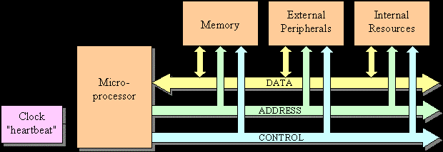
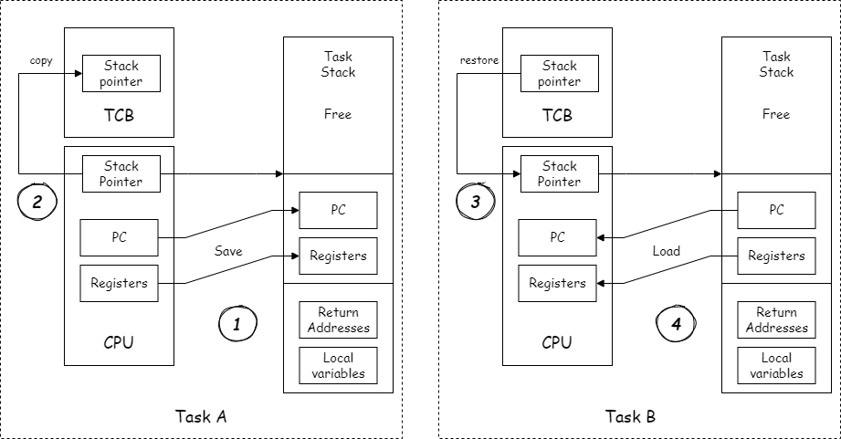
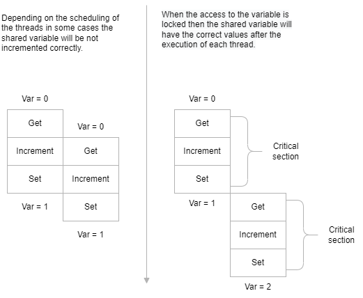

= Operating Systems
:toc:
:toclevels: 5


== 1. Hardware Basics



=== CPU
The CPU is the brain of a computer system and it is where the program is
executed. The design of a system starts with the CPU and determines the choices
of the bus and peripherals explained below.

The CPU consists of several parts

- Arithmetic and Logic Unit (ALU)
- Control Unit
- Registers


=== Bus

==== Control bus
This is the set of signals that is used to synchronize the activities of the
separate computer components. Some of these control signals, such as RD and
WR are sent by the CPU to the other elements to tell them what type of
operation is currently in progress. The I/O elements can send control
signals to the CPU. An example is the rest input (RES) of the CPU
which, when driven LOW, causes the CPU to reset to a particular
starting stare.

==== Address bus
This is a unidirectional bus, because information flows over it in only
one direction, from the CPU to other system components.

When the CPU wants to communicate with a certain memory location or I/O device,
it places the appropriate address code onto the address bus. The devices listen
on the address bus and if one of them recognizes its address it will respond to
the CPU request.

==== Data bus
This is a bi-directional bus, because data can flow to or from the CPU.


=== Register
=== Interrupt

Interrupts are a way to stop the current program execution and to jump to a
special program called an **Interrupt Service Routine (ISR)**. The interrupts
are an efficient mechanism used by I/O devices to signal that there is data
available and relieve the processor from constant polling of the I/O device status.

The interrupt service routines can interrupt tasks and take control immediately.
This could be quite detrimetral to the time constrains of the RTOS and this
is why interrupts must be used with caution and be as quick as possible.

The interrupts themselves can be also nested. An interrupt ca never be
interrupted by an interrupt of lower or equal priority. If two different
interrupts occur at the same time the one with the higher priority gets
executed first.

The first job of the interrupt should be to store the registar values of the
CPU and the last job should be to restore these values.

```text
TODO: Picture how the ISR is executed
```

=== Memory
=== Peripherals


== 2. Operating Systems

=== Overview

- manages how I/O devices communicate with the application (Chapter 1)
- offers a structural approach to develop applications (Chapter 2)
- offers a scheduler to allocated CPU time to different tasks (Chapter 3)
- offers a set of services for intertask communication (Chapter 5, 6)
- manages how the memory is organized and how it is allocated (Chapter 7)


=== Classification

image::assets/OS-Classification.png[OS-Classification]

The are several differentiation criteria used to classify the operating system.
If we take the access to the CPU in cosideration, then the operating systems
is be classified as ...

- A **single-task OS** that allows a single task to use the CPU
- A **multi-tasking OS** that allows the execution of multiple tasks on a
single CPU

Further operating systems might be further differentiated based on the number
of users such as ...

- A **single-user OS** allows only a single user to use the OS
- A **multi-user OS** allows multiple users to use the OS

And finally based on their use case, the operating systems might be divided
in the following categories ...

- **General-purpose OS** that ensures the execution of all tasks without
blocking (fairness)

- **Real-time OS** that ensures the execution of high priority tasks within a
strict time limit (deterministic)


Embedded systems are electronic devices that have a microprocessor but are not
computers and usually have a very specific purpose. Such systems are for
example the electronic control unit (ECU) of the car, smart TV, etc.

Embedded systems often use real-time operating systems, which execute
critical code within strict time constraints. If the constraints are not met
then this would be considered a failure. This kind of systems have the
advantage to be predictable (deterministic). This can be especially important
in measurement and automation systems where downtime is costly or a program
delay could cause a safety hazard.


=== Components

image:assets/OS-Structure.png[OS-Structure]

==== HAL

Many operating systems such as Linux or Windows are written in such a way
that they work without knowledge of the underlying hardware. This is achieved
by separating the interface from its implementation. The OS will only use the
interface. Depending on the usecase either the OS developer or the hardware producer
is responsible to implement the low level code accessed by the HAL API. These might
be register mappings, low level drivers, etc.

==== Kernel

The kernel is the main component of the operating system. It is responsible
for the allocation and partition of the sytem memory, the scheduling and switching
of the tasks and provides objects and services for taks synchronization and communication.
In many cases the kernel also provides device drivers to access common hardware such as
memory, UART,

==== Middleware

The middleware provides some additional features to the operating system, which
are very common but not strictly required for the OS to work. These might include
networking services, file system and graphics libraries. The middleware can be
easily extended by the user providing own interfaces and libraries.

==== OSAL

The OSAL (OS Abstraction Layer) is considered to be part of the middleware. It
allows the users to write applications, which might be ported to other operating
systems by separating the interface and the concrete implementation of common
kernel services, such as semaphors, mutexes and others. In the **UNIX** world
it is also named **POSIX**.

== 3. Task Management

=== Task Concept

A task is typically an infinite loop which never terminates. It is a
self-contained program which runs as if it had the microprocessor all to
itself.

Depending on the operating system a task can be understood as a thread or a
process. Threads are tasks that share the same address space, while processes
have their own address space.

image::assets/OS-TaskModel.png[OS-Taskmodel]

The process of sharing one CPU among many tasks and thus creating the
illusion of parallel work is called **concurrent execution**. The process of
running tasks on multiple processors is called **parallel executuion**.

=== Task States

The minimum set of states in typical task state model consists of
the following states ...

1. **Running** (takes control of the CPU);
2. **Ready** (ready to be executed);
3. **Waiting** (blocked until an event occurs ).

The following graphic shows several examples of popular operating systems to
illustrate the common and specific tasks states...

image::assets/OS-TaskStates.png[OS-TaskStates]

=== Task Scheduling

Schedulers determine which task to be executed at a given point of time and
differ mainly in the way they distribute computation time between tasks in
the READY state. The scheduler is one of the core features of the OS kernel.
Technically it is a program which is exectuted periodically. The period
between the executions is also called the **system tick**.

==== Round-robin

image::assets/OS_Scheduling_RoundRobin.png[Round-Robin scheduling]

With round-robin scheduling each task gets a certain amount of time or **time
slices** to use the CPU. After the predefined amount of time passes the
scheduler deactivates the running task and activates the next task that is in
the READY state. This ensures that each task gets some CPU time.

- No starvation effect as all tasks are executed
- Best reponse in terms of average reponse time accross all tasks
- Low slicing time reudces CPU efficiency due to frequent context switching
- Worser control of the timing of critical tasks

==== Priority scheduling

image::assets/OS_Scheduling_Priority.png[Priority scheduling]

With priority scheduling tasks are executed by their assigned prority.
Usually lower numbers mean higher priority.

- Good for systems with variable time and resource requirements
- Precise control of the timing of critical tasks
- Starvation effect possible for intensive high priority tasks
- Starvation can be mitigated with the aging technique or by adding small delays

==== First Come First Served

image::assets/OS_Scheduling_FirstComeFirstServed.png[First-Come-First-Served
scheduling]

With this type of algorithm tasks are executed in order of their arrival.
It is the easiest and simplest CPU scheduling algorithm.

- Simple implementation
- Starvation effect possible if a tasks takes a long time to execute
- Higher average wait time compared to other scheduling algorithms

==== Shortest Job First

image::assets/OS_Scheduling_ShortestJobFirst.png[Shortes-Job-First scheduling]

With SJF tasks with shorter execution time have higher priority when
scheduled for execution. This scheduling is mainly used to minimize the
waiting time.

- Starvation efect possible
- Best average waiting time
- Needs an estimation of the burst time

=== Task Switching

==== Task Data

Typically each task consists of folling parts...

- Task code
- Task variables
- Task stack
- Task control block (TCB)

The task’s stack has the same function as in a single-task system: storage of
return addresses of function calls, parameters and local variables, and
temporary storage of intermediate results and register values. Each task can
have a different stack size.

The **Task Control Block (TCB)** is a data structure assigned to a task when it
is created. The TCB contains status information for the task, including the
stack pointer, task priority, current task status (ready, waiting, reason for
suspension) and other management data. Knowledge of the stack pointer allows
access to the other registers, which are typically stored (pushed onto) the
stack when the task is created and each time it is suspended. This
information allows an interrupted task to continue execution exactly where it
left off. TCBs are only accessed by the RTOS.

Internally the OS will save the TCBs of all stacks in a dynamic list, which
might be changed on-demand if the OS allows creation of tasks in runtime.

```
TODO: Image illustrating the TCB and how it is chained
```


==== Multi-threaded model

In the multi-threading model, which is predominatly used in RTOS the task or
context switching is simplified the change of one set of CPU register values to
another set of CPU register values.



Switching algorithm:

1. Push the registers, variables on the stack of the current task
2. Push the stack pointer on the TCB of the current task
3. Load the stack pointer from the TCB of the new task
4. Load the registers and variables stored on the new task's stack

Some operating systems allow tasks to be interrupted by other more important
tasks. This is called a **preemptive** context switching and is the dominant
mechanism used in RTOS. The other type of switching is called **cooperative**
and in this case the task must explicitly release the CPU before another task
can take control.

==== Multi-process model

For multiprocessor systems each process has its own address space and cannot
address the memory of the other processes. The context switch requires the
re-configuration of a special chip called MMU (Memory Management Unit). The
role of the MMU is to map the process address space to the address space of
the physical memory.

```text
TODO: Picture with an explanation how the MMU works
```

==== Lightweight process model

The multi-process model is much more complex and time consuming and thus not
very useful for RTOS. If a MMU is present, the RTOS might use only to protect
other memory areas from being accessed by the current task. This model is
also called **"Thread Protected Mode"** or **"Lightweight Process Model**".

```text
TODO: Picture to illustrate how to use MMU to protect memory areas
```


== 4. Concurrency Issues

// ============================================================================

=== Race conditions



==== Scenario

Very often a resource cannot be shared and must be used by only one task in
order to produce a correct result. For example if several tasks require the
printer then the result will be often a random sequence of characters
depending on the scheduled execution of the tasks.

The most common code patterns associated with race coditions are...

- Check then act
- Read-Modify-Write
- Lazy initialization

==== Solution

To avoid race conditions we must define the access to the shared resource is
to define a critical section, which will not be accessed by any other tasks.
Critical sections can be defined by using **semaphores** or **mutexes**. The
disadvantage of this approach is the impact on the performance.


// ============================================================================

=== Deadlock

==== Scenario

A deadlock situation on a shared resource can arise if and only if all of the
following conditions occur simultaneously in a system (Coffman coditions) ...

1. Mutual exclusion : At least one resource uses mutual exclusion
2. Hold and wait : A process is holding a resource and waiting for resources
used by other processses
3. Circular wait : Each process must be waiting for a resource being held by
another process
4. No preemption : A resource can be released only voluntarily by the process
holding it


==== Solution

===== Deadlock Prevention
The deadlock prevention means simply that one of the Coffman condition must be
broken.

===== Deadlock Avoidance
The operating system will not allocate resources which will lead to the deadlock situation.

Banker, Dijsktra, Resource hierarchy, Arbitrator

===== Deadlock Detection
The deadlock is allowed but the operating system is able to detect it and
recover from it.

===== Mutual exlusion algorithms
The mutual exlusion algorithms are Dekker, Peterson, Lamport, Szymanski,
Taubenfeld, Maekawa and others.


// ============================================================================

=== Starvation

==== Scenario

Starvation is a problem encountered in concurrent computing where a process
is perpetually denied necessary resources to process its work. The priority
scheduling is a typical scenario where this situation might occur. It involves
one or more high priority tasks which run frequently.

==== Solution

- Task aging technique
- Delay in high priority tasks

// ============================================================================

=== Priority inversion

==== Scenario

Priority inversion is a scenario in scheduling in which a high priority task
is indirectly superseded by a lower priority task effectively inverting the
assigned priorities. A typical exapmple of priority inversion is
when several tasks with different priority levels use semaphores and try to
access the CPU ...

image::assets/OS-PriorityInversion.png[Priority inversion]

1. A Low Priority Task (LP Task) owns a semaphore for accessing a given resource
2. A High Prioriy Task (HP Task) waits for a resource currently owned by the
LP Task
3. A Medium Priority Task (MP Task) becomes ready-to-run (after an event
occurres or a delay passes) and preempts the LP Task.
4. The MP Task completes execution.
5. The LP Task resumes
6. The LP Task finishes using the resouce and releases the semaphore
7. The HP Task acquires the semaphore and resumes

In this situation the priority of the HP Task is essentially reduced to that
of the LP Task that it waits for to finish using a resource. Because of that
the HP Task gets unnecessarily delayed.

==== Solutions

Keywords: Disable interrupts, priority ceiling, priority inheritance, random
boosting, read-copy-update...

**Priority inheritance**

A mutex would elevate the priority of the LP task to that of the HP task.
In this way the medium priority task will not be scheduled for execution
while the mutex is acquired. This mechanism is also called priority inheritance.

image::assets/OS-PriorityInheritance.png[Priority inheritance]

1. A Low Priority Task (LP Task) owns a mutex for accessing a given resource
2. A High Prioriy Task (HP Task) waits for a resource currently owned by the LP Task
3. The priority of the LP task is elevated to that of the HP task
4. A Medium Priority Task (MP Task) becomes ready
5. The LP Task is temporary with higher priority and resumes
6. The LP Task finishes using the resource and releases the mutex
7. The HP Task acquires the mutex and resumes
8. The HP Task finishes using the resource and releases the mutex
9. The MP Task is scheduled for execution


== 5. Synchronization Objects

=== Signal

=== Event

Events are similar to interrupts in the sense that they are a signaling
mechanism.

=== Semaphore

Semaphore is an integer variable which is used as a **signaling mechanism**
to allow a process to access the critical section of the code or certain
other resources. A semaphore manages an internal counter which is decremented
by each `acquire()` call and incremented by each `release()` call. The
counter of the semaphore can never go below zero and when `acquire()` finds
that it is zero, it blocks, waiting until some other task calls `release()`.

Upon releasing the semaphore the kernel determines the highest priority task
waiting for the semaphore and passes it to the task. If the task releasing
the semaphore is of higher priority than the task waiting for the semaphore,
then the releasing task continues executing. Otherwise the releasing task is
preempted and the kernel switches to the waiting task.

Depending on the counter type there are two types of semaphores:

1. **Binary** - used to access a single resource.
It holds the value of 0 or 1, signaling that the resource is occupied or
available

2. **Counting** - A counting semaphore stores the number of free instances of
said resource and blocks until an instance becomes available.

=== Mutex

A mutex or the mutual exclusion service is a special type of **locking
mechanism** which resembles the binary semaphore. It implements additionally
an algorithm called **priority inheritance** to solve a common problem of
semaphores called **priority inversion**.

=== Lock

A reader-writer lock allows simultaneous access for read-only operations
while write operations require exclusive access.

Multiple tasks can read at the same time, but a writing task will block
others from reading or writing. A readers-writer block can also be
implemented using semaphores and mutexes.

=== Mailbox

- A mailbox is a **message buffer** managed by the RTOS.
- The messages have **fixed data size** and are usually small.
- Mailboxes work as **FIFO** (first in, first out)
- Tasks can **send and retrieve** messages to/from the mailbox
- If the **mailbox is empty the reading task be blocked** for a specified
amount of time or until a message arrives.
- When a message arrives the **kernel notifies the waiting task** and the
scheduler determines if a task switching must be done, according to the
priority of the running task and the task waiting for a message

=== Queues

- Queues are **message buffers**
- Queues accept **messages of different lengths**.
- The **message size must be passed as a parameter** along with the message.
- Tasks can **send and retrieve** messages to/from the queue
- If the **queue is empty the reading task be blocked** for a specified
amount of time or until a message arrives.
- When a message arrives the **kernel notifies the waiting task** and the
scheduler determines if a task switching must be done, according to the
priority of the running task and the task waiting for a message


== 6. Concurrency Models

=== Event-based Model
=== Actor-based Model


== 7. Memory management

```commandline
TODO: Image of the points below
```

- static for global and static variables
- stack for local variables
- heap for dynamic allocation
- Explain some important concepts such as memory initialization and NULL

```commandline
TODO: Image of the points below
```

- Explain the function of the linker
- Take a look at a program (for example .com, .exe or .elf)
- Explain how the program is loaded in to the memory


== 8. Boot process


After reset the CPU always jumps to a predefined address and starts the
execution from there. Typically the instruction found at this address is a
simple jump to the bootloader code.

The bootloader initializes the memory and for simple operating systems the next
step is to call the main function. The main function will the further
initialize the kernel, the hardware, create application tasks and
then transfer control to the scheduler.

```commandline
TODO: Boot process visualization
```

== 9. Best practices

- Each task is to be considered an application of its own
- Initialize shared resources before task creation
- Separate system diagnostics and fault detection into a separate task
- Use RTOS to monitor task health
- Evaluate potential system failures and recovery strategies
- Use design patterns to improve maintenance and development

---

- Optimization of functions (3 parameters, 4 bytes)
- Semaphore is a check, Mutex blocks

---

The main() function will not be interrupted by any of the created tasks
because those tasks execute only following the call to OS_Start(). It is
therefore usually recommended to create all or most of your tasks here, as
well as your control structures such as mailboxes and semaphores. Good
practice is to write software in the form of modules which are (up to a
point) reusable. These modules usually have an initialization routine, which
creates any required task(s) and control structures. A typical main()
function looks similar to the following example:

```commandline
void main(void) {

  // Initialize embOS (must be first)
  OS_Init();

  // Initialize hardware for embOS (in RTOSInit.c)
  OS_InitHW();

  // Call Init routines of all program modules which in turn will create
  // the tasks they need ... (Order of creation may be important)
  MODULE1_Init();
  MODULE2_Init();
  MODULE3_Init();
  MODULE4_Init();
  MODULE5_Init();

  // Start multitasking
  OS_Start();
}
```

== 10. Exercises

=== Installation

=== Program models
==== Single loop
==== Main loop and ISR
==== RTOS and Tasks

=== Task Objects
==== Semaphore
==== Mutex
==== Signal
==== Event

=== Concurrency issues
==== Race Conditions
==== Deadlock
==== Starvation
==== Priority inversion

=== GPIO
=== Ethernet
=== Debug

== References

- <https://www.ni.com/en-rs/innovations/white-papers/07/what-is-a-real-time-operating-system--rtos--.html>
- <https://www.youtube.com/playlist?list=PLEBQazB0HUyQ4hAPU1cJED6t3DU0h34bz>
- <https://www.tutorialspoint.com/operating_system/os_process_scheduling_algorithms.htm>
- <https://data-flair.training/blogs/scheduling-algorithms-in-operating-system/>
- <https://digital.com/program-your-own-os/>
- <https://littleosbook.github.io/>
- <https://www.geeksforgeeks.org/mutex-vs-semaphore/>
- <https://www.beningo.com/5-best-practices-for-designing-rtos-based-applications/>
- <https://kb.hilscher.com/display/GPS/Job-Worker+Task+Model>
- <https://en.wikipedia.org/wiki/Booting>
- <https://webeduclick.com/windows-2000-threads-and-smp-management>
- <https://en.wikipedia.org/wiki/Synchronization_(computer_science>)
- <https://www.microcontrollertips.com/three-rtos-basics-what-when-and-how/>
- <https://www.renesas.com/eu/en/software-tool/hw-rtos/hw-rtos-concept>
- <https://medium.com/@ianjuma/the-actor-model-in-python-with-gevent-b8375d0986fa>
- <https://en.wikipedia.org/wiki/Concurrent_computing>
- <https://citeseerx.ist.psu.edu/viewdoc/summary?doi=10.1.1.64.5120>
- <https://preshing.com/20120612/an-introduction-to-lock-free-programming/>
- <https://www.baeldung.com/concurrency-principles-patterns>
- <https://www.oreilly.com/library/view/the-art-of/9780596802424/ch04.html>
- <https://www.brianstorti.com/the-actor-model>
- <https://en.wikipedia.org/wiki/Actor_model>
- <https://en.wikipedia.org/wiki/Concurrent_computing>
- <https://en.wikipedia.org/wiki/Mutual_exclusion>
- <https://en.wikipedia.org/wiki/Dekker%27s_algorithm>

