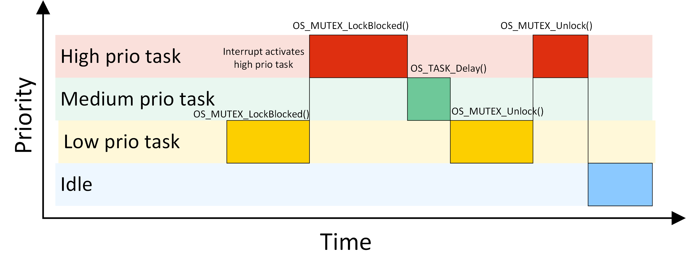

= Operating Systems
:toc:
:toclevels: 4

== Introduction

The operating system ...

- allows an easy scaling of the application (Chapters 2, 3, 4)
- manages how the CPU is allocated to different tasks (Chapters 5, 6, 7)
- manages how I/O devices communicate with the application (Chapter 8)
- manages how the memory is organized and how it is allocated (Chapter 9)
- manages the startup of the hardware (Chapter 10)

== Classification

image::assets/OS-Classification.png[OS-Classification]

The are several differentiation criteria used to classify the operating system.
If we take the access to the CPU in cosideration, then the operating systems
is be classified as ...

- A **single-task OS** that allows a single task to use the CPU
- A **multi-tasking OS** that allows the execution of multiple tasks on a
single CPU

Further operating systems might be further differentiated based on the number
of users such as ...

- A **single-user OS** allows only a single user to use the OS
- A **multi-user OS** allows multiple users to use the OS

And finally based on their use case, the operating systems might be divided
in the following categories ...

- **General-purpose OS** that ensures the execution of all tasks without
blocking
- **Real-time OS** that ensures the execution of high priority tasks within a
time limit
- **Distributed OS** that ensures the distribution of task on physically
separated CPUs

== Components

Embedded systems are electronic devices that have a microprocessor but is not
a computer and have a very specific purpose. Such systems are for example the
electronic control unit (ECU) of the car, smart TV, etc.

Embedded systems often use real-time operating systems, which execute code
within strict time constraints. If the constraints are not met then this
would be considered a failure. This kind of systems have the advantage to be
predictable or also called deterministic.

image:assets/OS-Structure.png[OS-Structure]

=== 2.1. HAL

Many operating systems such as Linux or Windows are written in such a way
that they work without knowledge of the underlying hardware. This is achieved
by separating the interface from its implementation. The OS will use only the
interface. The vendor of the OS or a hardware product is then responsible to
implement the interface for a concrete platform.

=== 2.2. Kernel

The kernel is the main component of the operating system. It is responsible
for the allocation and partition of the sytem memory, the handling and
scheduling of the tasks and provides services for taks synchronization and
communication. In many cases the kernel also provides device drivers to
access the hardware.

=== 2.3. Middleware

The middleware provides some additional functionality to the operating system.
These might include networking services, file system and

=== 2.4. OSAL

The middleware can be easily extended by the user providing own interfaces
and libraries. One very useful component as part of the middleware is **OS
abstraction layer** or the **OSAL**. As its counterpart on the hardware
level, it allow separation of the interface of the basic kernel services from
its implementation. This increases the reusability of the programming
application allwoing the same software to run on different operating systems.
In the **UNIX** world it is also named **POSIX**.

== Dataflow diagram

image::assets/OS-Dataflow.png[OS-Dataflow]

The task usually can call the drivers and libraries from the middleware or
the OS. Additionally to increase the usability of the program the task has
also access to the OSAL interface. The middleware itself might use also OSAL
for better reusability and has access to basic drivers provided by the
operating system. The drivers and the kernal of the OS always access the
hardware using the hardware abstraction layer.

== Runtime diagram

image::assets/OS-Runtime.png[OS-Runtime]

The idle task is responsible for freeing memory allocated by the RTOS to
tasks that have since been deleted. It is therefore important in applications
to ensure the idle task is not starved of processing time.

== Task management

=== 5.1. Task concept

A task is a simple program that runs as if it had the microprocessor all to
itself. It is a set of register values and some local data. Each tasks owns a
stack space to store temporary values and executes specific functions. Tasks
might also have a priority based on their importance. Depending on the
operating system a task can be understood as a thread or a process. Threads
are tasks that share the same address space, while processes have their own
address space.

image::assets/OS-TaskModel.png[OS-Taskmodel]

=== 5.2. Task states

image::assets/OS-TaskStates.png[OS-TaskStates]

The minimum set of states in typical task state model consists of
the following states ...

1. **Running** (takes control of the CPU);
2. **Ready** (ready to be executed);
3. **Waiting** (blocked until an event occurrs, I/O for example).

=== 5.3. Task scheduling

Schedulers determine which task to be executed at a given point of time and
differ mainly in the way they distribute computation time between tasks in
the READY state. The scheduler is one of the core features of the OS kernel.
Technically it is a program which is exectuted periodically. The period
between the executions is also called the **system tick**.

==== 5.3.1. Round-robin


With round-robin scheduling each task gets a certain amount of time or **time
slices** to use the CPU. After the predefined amount of time passes the
scheduler deactivates the running task and activates the next task that is in
the READY state. This ensures that each task gets some CPU time.

- No starvation effect as all tasks are executed
- Best reponse in terms of average reponse time accross all tasks
- Low slicing time reudces CPU efficiency due to frequent context switching
- Worser control of the timing of critical tasks

==== 5.3.2. Priority scheduling

image::assets/OS_Scheduling_Priority.png[Priority scheduling]

With priority scheduling tasks are executed by their assigned prority.
Usually lower numbers mean higher priority.

- Good for systems with variable time and resource requirements
- Precise control of the timing of critical tasks
- Starvation effect possible for intensive high priority tasks
- Starvation can be mitigated with the aging technique or by adding small delays

==== 5.3.3. First Come First Served

image::assets/OS_Scheduling_FirstComeFirstServed.png[First-Come-First-Served
scheduling]

With this type of algorithm tasks are executed in order of their arrival.
It is the easiest and simplest CPU scheduling algorithm.

- Simple implementation
- Starvation effect possible if a tasks takes a long time to execute
- Higher average wait time compared to other scheduling algorithms

==== 5.3.4. Shortest Job First

image::assets/OS_Scheduling_ShortestJobFirst.png[Shortes-Job-First scheduling]

With SJF tasks with shorter execution time have higher priority when
scheduled for execution. This scheduling is mainly used to minimize the
waiting time.

- Starvation efect possible
- Best average waiting time
- Needs an estimation of the burst time

=== 5.4. Task switching

==== 5.4.1. Multi-threaded model

In the multi-threading model, which is predominatly used in RTOS the task or
context switching is simply the change of one set of CPU register values to
another set of CPU register values. The register values are also called the
task state and it is stored in a special data structure called the **Task
Control Block (TCB)**. The TCB contains a task's name, ID, priority, state
and others.

```text
TODO : Image illustrating the task switching algorithm
```

Switching algorithm:

1. Push the processor registers on the stack of the current task
2. Push the stack pointer on the stack of the current task
3. Push the local variables and return addresses on the stack
4. Load the stack pointer from the TCB of the new task
5. Load the processor registers from the values stored on the new task's stack

Some operating systems allow tasks to be interrupted by other more important
tasks. This is called a **preemptive** context switching and is the dominant
mechanism used in RTOS. The other type of switching is called **cooperative**
and in this case the task must explicitly release the CPU before another task
can take control.

==== 5.4.2. Multi-process model

For multiprocessor systems each process has its own address space and cannot
address the memory of the other processes. The context swap requires the
re-configuration of a special chip called MMU (Memory Management Unit). The
role of the MMU is to map the process address space to the address space of
the physical memory.

```text
TODO: Picture with an explanation how the MMU works
```

==== 5.4.3. Lightweight process model

This operation is much more complex and time consuming and thus not very
useful for RTOS. If a MMU is present, the RTOS might use it to just protect
other memory areas from being accessed by the current task. This model is
also called **"Thread Protected Mode"** or **"Lightweight Process Model**".

=== 5.5. Interrupts

Interrupts are a way to stop the current program execution and to jump to a
special program called an **Interrupt Service Routine (ISR)**. The interrupts
are an efficient mechanism used by I/O devices to signal that there is data
available and relieve the processor from constant polling of the I/O device status.

The interrupt service routines can interrupt tasks and take control immediately.
This could be quite detrimetral to the time constrains of the RTOS and this
is why interrupts must be used with caution and be as quick as possible.

The interrupts themselves can be also nested. An interrupt ca never be
interrupted by an interrupt of lower or equal priority. If two different
interrupts occur at the same time the one with the higher priority gets
executed first.

The first job of the interrupt should be to store the registar values of the
CPU and the last job should be to restore these values.

```text
TODO: Picture how the ISR is executed
```

=== 5.6. Practice

- Write a scheduler with a priority switching
- Write a scheduler with round robin switching
- Write a scheduler with first-come-first-served scheduling


== Concurrency issues

=== Race condition

==== Scenario
In concurrent systems taks can request shared resources at the same time,
such as the printer or the hard drive. For example it is impossible to print
text from two tasks, because the printed document will be a random sequence
of characters depending on when the tasks access the printer. Such scenarios
are called **race conditions**.The operating systems proivides special
mechanisms to prevet such conditions.

==== Solution
Use OS services to lock shared resources so that they can be used only by a
limited number of tasks. Such services are the mutex, semaphores and
reader-writer locks.


=== Deadlock

==== Scenario

A deadlock situation on a resource can arise if and only if all of the
following conditions occur simultaneously in a system (Coffman coditions) ...

- Mutual exclusion : At least one resource uses mutual exclusion
- Hold and wait : A process is holding a resource and waiting for resources used
by other processses
- No preemption : A resource can be released only voluntarily by the process
holding it
- Circular wait : Each process must be waiting for a resource being held by
another process

==== Solution

Prevention

- Task priority and preemption
- Lock ordering

Avoidance

- Break one of the deadlock conditions
- Dijkstra's solution
- Resource hierarchy solution
- Arbitrator solution

=== Starvation

Starvation is a problem encountered in concurrent computing where a process
is perpetually denied necessary resources to process its work.

==== Scenario

- High priority tasks run frequently

==== Solution

- Task aging technique
- Delay in high priority tasks

=== Priority inversion

==== Scenario

Priority inversion is a scenario in scheduling in which a high priority task
is indirectly superseded by a lower priority task effectively inverting the
assigned priorities of the tasks. A typical exapmple of priority inversion is
when several tasks with different priority levels use semaphores and try to
access the CPU ...



1. A Low Priority Task (LP Task) owns a semaphore for accessing a given resource
2. A High Prioriy Task (HP Task) waits for a resource currently owned by the
LP Task
3. A Medium Priority Task (MP Task) becomes ready-to-run (after an event
occurres or a delay passes) and preempts the LP Task.
4. The MP Task completes execution.
5. The LP Task resumes
6. The LP Task finishes using the resouce and releases the semaphore
7. The HP Task acquires the semaphore and resumes

In this situation the priority of the HP Task is essentially reduced to that
of the LP Task that it waits for to finish using a resource. Because of that
the HP Task gets unnecessarily delayed.

==== Solutions

Keywords: Disable interrupts, priority ceiling, priority inheritance, random
boosting, read-copy-update...

**Priority inheritance**

A mutex would elevate the priority of the LP task to that of the HP task.
In this way the medium priority task will not be scheduled for execution
while the mutex is acquired. This mechanism is also called priority inheritance.

image::assets/OS-PriorityInheritance.png[Priority inheritance]

1. A Low Priority Task (LP Task) owns a mutex for accessing a given resource
2. A High Prioriy Task (HP Task) waits for a resource currently owned by the LP Task
3. The priority of the LP task is elevated to that of the HP task
4. A Medium Priority Task (MP Task) becomes ready
5. The LP Task is temporary with higher priority and resumes
6. The LP Task finishes using the resource and releases the mutex
7. The HP Task acquires the mutex and resumes
8. The HP Task finishes using the resource and releases the mutex
9. The MP Task is scheduled for execution


== Task synchronization

``
TODO: Picture with some race conditions examples
``

=== 6.1 Semaphore

Semaphore is an integer variable which is used as a **signaling mechanism**
to allow a process to access the critical section of the code or certain
other resources. A semaphore manages an internal counter which is decremented
by each `acquire()` call and incremented by each `release()` call. The
counter of the semaphore can never go below zero and when `acquire()` finds
that it is zero, it blocks, waiting until some other task calls `release()`.

Upon releasing the semaphore the kernel determines the highest priority task
waiting for the semaphore and passes it to the task. If the task releasing
the semaphore is of higher priority than the task waiting for the semaphore,
then the releasing task continues executing. Otherwise the releasing task is
preempted and the kernel switches to the waiting task.

Depending on the counter type there are two types of semaphores:

1. **Binary** - used to access a single resource.
It holds the value of 0 or 1, signaling that the resource is occupied or
available

2. **Counting** - A counting semaphore stores the number of free instances of
said resource and blocks until an instance becomes available.

=== 6.2 Mutex

A mutex or the mutual exclusion service is a special type of **locking
mechanism** which resembles the binary semaphore. It implements additionally
an algorithm called **priority inheritance** to solve a common problem of
semaphores called **priority inversion**.

=== 6.3. Lock

A reader-writer lock allows simultaneous access for read-only operations
while write operations require exclusive access.

Multiple tasks can read at the same time, but a writing task will block
others from reading or writing. A readers-writer block can also be
implemented using semaphores and mutexes.

=== 6.4. Event

Events are similar to interrupts in the sense that they are a signaling
mechanism.


== Task communication

=== 7.1 Mailbox

- A mailbox is a **message buffer** managed by the RTOS.
- The messages have **fixed data size** and are usually small.
- Mailboxes work as **FIFO** (first in, first out)
- Tasks can **send and retrieve** messages to/from the mailbox
- If the **mailbox is empty the reading task be blocked** for a specified
amount of time or until a message arrives.
- When a message arrives the **kernel notifies the waiting task** and the
scheduler determines if a task switching must be done, according to the
priority of the running task and the task waiting for a message

=== 7.2 Queues

- Queues are **message buffers**
- Queues accept **messages of different lengths**.
- The **message size must be passed as a parameter** along with the message.
- Tasks can **send and retrieve** messages to/from the queue
- If the **queue is empty the reading task be blocked** for a specified
amount of time or until a message arrives.
- When a message arrives the **kernel notifies the waiting task** and the
scheduler determines if a task switching must be done, according to the
priority of the running task and the task waiting for a message

== Memory management

```commandline
TODO: Image of the points below
```

- static for global and static variables
- stack for local variables
- heap for dynamic allocation
- Explain some important concepts such as memory initialization and NULL

```commandline
TODO: Image of the points below
```

- Explain the function of the linker
- Take a look at a program (for example .com, .exe or .elf)
- Explain how the program is loaded in to the memory

== Boot process

After reset the CPU always jumps to a predefined address and starts the
execution from there. The program found there is called the startup code. It
initializes the memory and for simple operating systems the next step is to
call the main function. The main function will the further initialize the
operating system, the hardware, create application tasks and then transfer
control to the scheduler.

```commandline
TODO: Boot process visualization
```

== Best practices

- Each task is to be considered an application of its own
- Initialize shared resources before task creation
- Separate system diagnostics and fault detection into a separate task
- Use RTOS to monitor task health
- Evaluate potential system failures and recovery strategies
- Use design patterns to improve maintenance and development

---

- Optimization of functions (3 parameters, 4 bytes)
- Semaphore is a check, Mutex blocks

---

The main() function will not be interrupted by any of the created tasks
because those tasks execute only following the call to OS_Start(). It is
therefore usually recommended to create all or most of your tasks here, as
well as your control structures such as mailboxes and semaphores. Good
practice is to write software in the form of modules which are (up to a
point) reusable. These modules usually have an initialization routine, which
creates any required task(s) and control structures. A typical main()
function looks similar to the following example:

```commandline
void main(void) {

  // Initialize embOS (must be first)
  OS_Init();

  // Initialize hardware for embOS (in RTOSInit.c)
  OS_InitHW();

  // Call Init routines of all program modules which in turn will create
  // the tasks they need ... (Order of creation may be important)
  MODULE1_Init();
  MODULE2_Init();
  MODULE3_Init();
  MODULE4_Init();
  MODULE5_Init();

  // Start multitasking
  OS_Start();
}
```

== References

- <https://www.youtube.com/playlist?list=PLEBQazB0HUyQ4hAPU1cJED6t3DU0h34bz>
- <https://www.tutorialspoint.com/operating_system/os_process_scheduling_algorithms.htm>
- <https://data-flair.training/blogs/scheduling-algorithms-in-operating-system/>
- <https://digital.com/program-your-own-os/>
- <https://littleosbook.github.io/>
- <https://www.geeksforgeeks.org/mutex-vs-semaphore/>
- <https://www.beningo.com/5-best-practices-for-designing-rtos-based-applications/>
- <https://kb.hilscher.com/display/GPS/Job-Worker+Task+Model>
- <https://en.wikipedia.org/wiki/Booting>
- <https://webeduclick.com/windows-2000-threads-and-smp-management>
- <https://en.wikipedia.org/wiki/Synchronization_(computer_science>)
- <https://www.microcontrollertips.com/three-rtos-basics-what-when-and-how/>
- <https://www.renesas.com/eu/en/software-tool/hw-rtos/hw-rtos-concept>