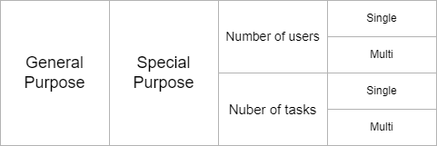
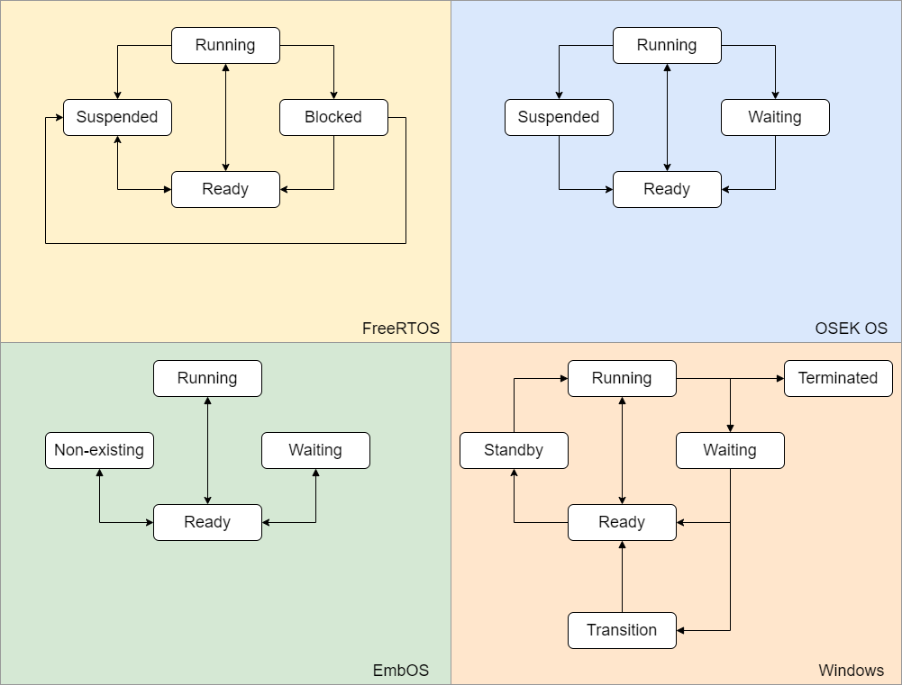
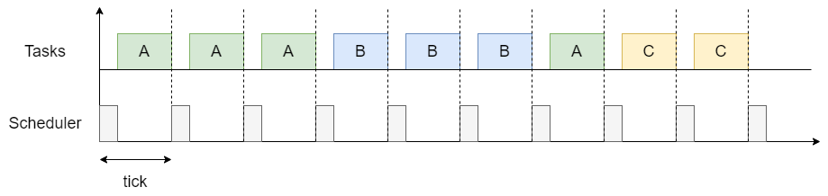
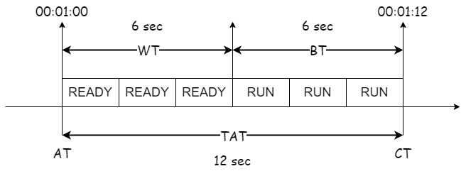
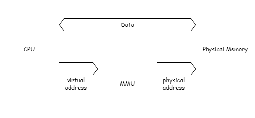
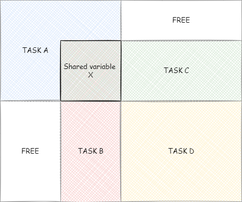
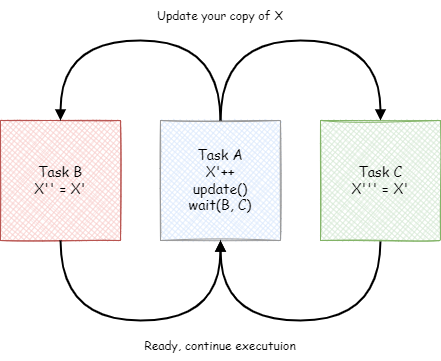
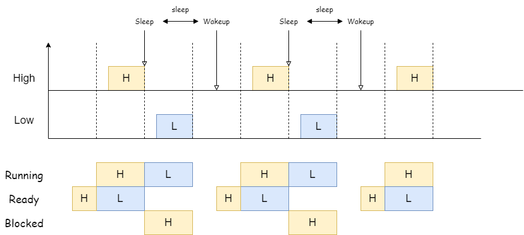
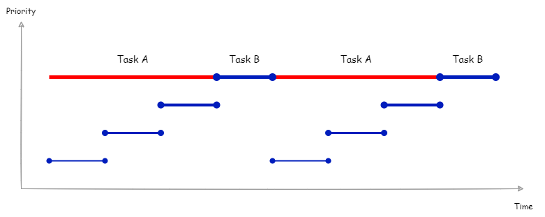
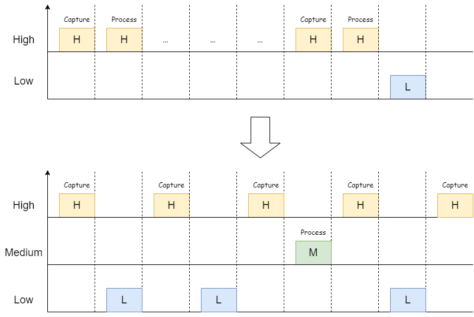

= Operating Systems
:toc:
:toclevels: 5


== 1. Hardware Basics

//image::assets/OS-Hardware-Basics.png[640, 480]
//
//=== CPU
//The CPU is the brain of a computer system and it is where the program is
//executed. The design of a system starts with the CPU and determines the choices
//of the bus and peripherals explained below.
//
//The CPU consists of several parts
//
//- Arithmetic and Logic Unit (ALU)
//- Control Unit
//- Registers
//
//=== Registers
//
//=== Control Bus
//This is the set of signals that is used to synchronize the activities of the
//separate computer components. Some of these control signals, such as RD and
//WR are sent by the CPU to the other elements to tell them what type of
//operation is currently in progress. The I/O elements can send control
//signals to the CPU. An example is the rest input (RES) of the CPU
//which, when driven LOW, causes the CPU to reset to a particular
//starting stare.
//
//=== Address Bus
//This is a unidirectional bus, because information flows over it in only
//one direction, from the CPU to other system components.
//
//When the CPU wants to communicate with a certain memory location or I/O device,
//it places the appropriate address code onto the address bus. The devices listen
//on the address bus and if one of them recognizes its address it will respond to
//the CPU request.
//
//=== Data Bus
//This is a bi-directional bus, because data can flow to or from the CPU.
//
//=== Memory Chip
//
//=== Peripheral Device
//
//=== Interrupt Controller
//
//Interrupts are a way to stop the current program execution and to jump to a
//special program called an **Interrupt Service Routine (ISR)**. The interrupts
//are an efficient mechanism used by I/O devices to signal that there is data
//available and relieve the processor from constant polling of the I/O device status.
//
//The interrupt service routines can interrupt tasks and take control immediately.
//This could be quite detrimetral to the time constrains of the RTOS and this
//is why interrupts must be used with caution and be as quick as possible.
//
//The interrupts themselves can be also nested. An interrupt ca never be
//interrupted by an interrupt of lower or equal priority. If two different
//interrupts occur at the same time the one with the higher priority gets
//executed first.
//
//The first job of the interrupt should be to store the registar values of the
//CPU and the last job should be to restore these values.
//
//```text
//TODO: Picture how the ISR is executed
//```
//
//=== System Clock


== 2. Concepts

=== 2.1. Features of operating systems

- offers a structural approach to develop complex applications (Chapter 2)
- offers a scheduler to allocate CPU time to different tasks (Chapter 3)
- offers a set of services for intertask communication (Chapter 4, 5)
- manages how I/O devices communicate with the application (Chapter 6)
- manages how the memory is organized and how it is allocated (Chapter 7)


=== 2.2. Classification of operating systems





The are several differentiation criteria used to classify the operating system.
If we take the access to the CPU in cosideration, then the operating systems
is be classified as ...

- A **single-task OS** that allows a single task to use the CPU
- A **multi-tasking OS** that allows the execution of multiple tasks on a
single CPU

Further operating systems might be further differentiated based on the number
of users such as ...

- A **single-user OS** allows only a single user to use the OS
- A **multi-user OS** allows multiple users to use the OS

And finally based on their use case, the operating systems might be divided
in the following categories ...

- **General-purpose OS** that ensures the execution of all tasks without
blocking (fairness)

- **Real-time OS** that ensures the execution of high priority tasks within a
strict time limit (deterministic)

=== 2.3. Layers in an operating system


image:assets/OS-Structure.png[]


==== 2.3.1. HAL

Many operating systems such as Linux or Windows are written in such a way
that they work without knowledge of the underlying hardware. This is achieved
by separating the interface from its implementation. The OS will only use the
interface. Depending on the usecase either the OS developer or the hardware producer
is responsible to implement the low level code accessed by the HAL API. These might
be register mappings, low level drivers, etc.

==== 2.3.2. Kernel

The kernel is the main component of the operating system. It is responsible
for the allocation and partition of the sytem memory, the scheduling and switching
of the tasks and provides objects and services for taks synchronization and communication.
In many cases the kernel also provides device drivers to access common hardware such as
memory, UART,

==== 2.3.3. Middleware

The middleware provides some additional features to the operating system, which
are very common but not strictly required for the OS to work. These might include
networking services, file system and graphics libraries. The middleware can be
easily extended by the user providing own interfaces and libraries.

==== 2.3.4. OSAL

The OSAL (OS Abstraction Layer) is considered to be part of the middleware. It
allows the users to write applications, which might be ported to other operating
systems by separating the interface and the concrete implementation of common
kernel services, such as semaphors, mutexes and others. In the **UNIX** world
it is also named **POSIX**.


=== 2.4. Real-time operating systems

Embedded systems are electronic devices with a microprocessor and usually
serve a very specific purpose. Such systems for example are the electronic
control unit (ECU) of the car, smart TV, etc.

Embedded systems often use a real-time operating system, which execute
critical code within strict time constraints. If the constraints are not met
then this would be considered a failure. This systems have the advantage to be
predictable (deterministic). This can be especially important in measurement
and control, where a small delay can be a safety hazard.

Some time-critical systems are for example the steam turbine control, which
require a reaction time in the order of 50 ms, airbag systems with reaction
time between 15 ms and 30 ms and autonomous driving with reaction times less
than 20 ms.

== 3. Multitasking

=== 3.1. Task Concept

A task is typically an infinite loop which never terminates. It is a
self-contained program which runs as if it had the microprocessor all to
itself. Depending on the operating system a task can be understood as a thread
or a process. Threads are tasks that share the same address space, while
processes have their own address space.


image::assets/OS-TaskModel.png[800, 600]


=== 3.2. Task States

The minimum set of states in typical task state model consists of
the following states:

1. **Running** (takes control of the CPU);
2. **Ready** (ready to be executed);
3. **Waiting** (blocked until an event occurs ).

The following graphic shows several examples of popular operating systems to
illustrate the common and specific tasks states.




=== 3.3. Task Scheduling

Schedulers determine which task to be executed at a given point of time and
differ mainly in the way they choose the running task from a list of tasks in
the READY state.



The scheduler is one of the core features of the OS kernel. Technically it is
a program which is exectuted periodically. The frequency of the scheduler
execution depends on the the **system tick** and determines how quick a task
would be run if it becomes ready.

The process of choosing the next task to be run is called a **scheduling
algorithm**. The following illustration gives the most common terms used in the
evaluation of scheduling algorithms.



|===
|Parameter | Description

|Arrival Time (AT)
|The point of time in which the task is marked as READY.

|Completition Time (CT)
|The point of time in which the task completed its execution.

|Wait Time (WT)
|The amount of time the process stays in the READY queue.

|Burst Time (BT)
|The amount of time in which the task is in the RUNNING state.

|Turnaround Time (TAT)
|The total time required by the process, the sum of the wait and burst time.

|Priority
|The process priority.

|===


==== 3.3.1. Round-Robin Scheduling


With round-robin scheduling each task gets a certain amount of time or **time
slices** to use the CPU. After the predefined amount of time passes the
scheduler deactivates the running task and activates the next task that is in
the READY state. This ensures that each task gets some CPU time.

- No starvation effect as all tasks are executed
- Best reponse in terms of average reponse time accross all tasks
- Low slicing time reudces CPU efficiency due to frequent context switching
- Worser control of the timing of critical tasks

==== 3.3.2. Priority Scheduling


With priority scheduling the tasks are executed in order of their assigned
priority. Usually lower numbers mean higher priority and thus will be executed
more often.

- Good for systems with variable time and resource requirements
- Precise control of the timing of critical tasks
- Starvation effect possible for intensive high priority tasks
- Starvation can be mitigated with the aging technique or by adding small delays

==== 3.3.3. First Come First Served Scheduling


With this type of algorithm tasks are executed in order of their arrival.
It is the easiest and simplest CPU scheduling algorithm.

- Simple implementation
- Starvation effect possible if a tasks takes a long time to execute
- Higher average wait time compared to other scheduling algorithms

==== 3.3.4. Shortest Job First Scheduling


image::assets/OS-Scheduling-ShortestJobFirst.png[800, 600]


With SJF tasks with shorter execution time have higher priority when
scheduled for execution. This scheduling is mainly used to minimize the
waiting time.

- Starvation effect possible
- Best average waiting time
- Needs an estimation of the burst time

=== 3.4. Task Switching

A typical task consists of following parts:

- Task Code
- Task Variables
- Task Stack
- Task Control Block (TCB)

The task stack is used as a temorary storage for local variables and
some register values before the switching process. The TCB is a data structure
assigned to a task when it is created and contains status information about
the task. The operating system determines how to efficiently distribute the task
state between the task stack and the TCB during the switching process.

Some operating systems allow tasks to be interrupted by other more important
tasks. This is called a **preemptive context switching** and is the dominant
mechanism used in RTOS. The other type of switching is called **cooperative
context switching** and in this case the task must explicitly release the CPU
before another task can take control.

==== 3.4.1. Multi-threaded model switching

In the multi-threading model predominatly used in RTOS, the task or context
switching is simplified the change of one set of CPU register values to another
set of CPU register values.

image::assets/OS-Multi-Threaded-Switch.png[800, 600]

**Switching algorithm**

1. Push the CPU registers on the stack of the current task
2. Save the stack pointer on the TCB of the current task
3. Restore the stack pointer from the TCB of the new task
4. Load the registers and variables stored on the new task's stack


==== 3.4.2. Multi-process model switching

For multiprocessor systems each process has its own address space and cannot
address the memory of the other processes. The context switch requires the
re-configuration of a special chip called MMU (Memory Management Unit).



The MMU allows the allocation of a portion of the virtual address space. This
portion is also called a memory page. The role of the MMU is to map the
process address space to the address space of the physical memory by using
translation tables.  Additionally it protects the task from accessing resources
outside its own memory space. An exception will be generated if tries to
access resources outside this region.


=== 3.5. Concurrency vs Parallelism

The process of sharing one CPU among many tasks and thus creating the
illusion of parallel work is called **concurrent execution**. The process of
running tasks on multiple processors is called **parallel executuion**.


image::assets/OS-Concurrent-vs-Parallel.png[800, 600]


== 4. Multitasking Problems

Tasks are a very convinient way to modularize the development process and
optimize the CPU utilization using concurrency. But they also come with a price
when several tasks have to exchange data. A brief summary of the most common
synchronization problems is given below.


image::assets/OS-Synchronization-Problems.png[]


=== 4.1. The Task Dependency Problem

The first and most important problem arising when using several tasks to
implement a software product is how to control the program flow of a task in
case it depends on the state of another tasks, and how to ensure that the data
exchanged between the tasks is consistent.

The simplest and fastest way to solve the dependency problem is to dedicate a
special region and declared it common for all the tasks using it. This technique
is called the **shared memory model**. It is very convinient for threads, as
they have a shared address space by definition.





The shared memory can represent an output device, or a counter to be modified
by every task, or a buffer used to store messages exchanged by the tasks. The
advantage of the shared memory model is its simplicity and speed, but has the
disadvantage of being very difficult to be analyzed formally.

For distributed or multi-processor systems the the **message passing model**
might be better suited. It avoids shared states and uses messages messages
to synchronize the tasks execution and to exchange data. Each task will have its
local representation of the shared resource. Using this model allows the
software to be analyzed formally but at the price of reduced efficieny. This
model requires more time to achieve a synchronzied state.





The message passing model is the foundation of many formal process algegras used
to analyze concurrent or parallel systems such as the **actor modell**,
**pi-calculus**, **CSP**, *CCS*, **ACP**, **LOTOS**, **PEPA** and others.

The message passing model has two modes of operation: **sychronous message
passing** and **asynchronous message passing**.

The synchronous message passing will send a message and wait until the receiver
responds with a message yielding the result of the operation.

The asynchronous message passing will not wait for the receiver to return the
results. On the receiver side the request message will be saved in a queue and
when its processing is done a result message will be stored in an output message
queue.

The problems following in this chapter apply to both the shared memory and
the message passing model. For simplicity the problem formulation will be based
only on tasks using shared memory.

// ============================================================================

=== 4.2. The Race Condition Problem

Very often a resource must be used by only one task in order to produce the
correct result. For example if several tasks require the printer then the
result will be often a random sequence of characters depending on the scheduled
execution of the tasks.

A similar example can be given with a shared variable instead of a printer.
Let's assume that a task must write a value to a counter variable, which will
be shared among several tasks. This variable might be used to count how many
symbols were sent to the printer totally and when a certain threshold is reached
it will prevent all tasks from printing until the device is serviced. As in the
printer scenario, a task might actually produce an invalid value depending
on the execution scheduling of the tasks.


The counter is supposed to be incremented 3 times but due to task interleaving
the final value is incorrect. The main problem appears to be that several
operations are needed to increment the value of the counter and the scheduler
is not aware of this. This is a very common problem and the reason
why race conditions occur. In the example above the operations are needed to
update the value of the counter are **read, modify and write**.

Another possible context for race conditions is the **check-then-act**
scenario. In the example below the second task will be terminated by an
exception as Task B will try to remove an element from the global list, which
was already removed by task A in the previous cycle.

image::assets/OS-Race-Conditions-2.png[]

==== 4.1.1. Solution with critical section

The first option to avoid race conditions is to ensure that only one task has
the shared resource during its usage. The operations which need to executed
without interruption are called **critical section**. Experienced programmes are
familiar with several implementations of the critical section such as
**semaphores** or **mutexes**. The disadvantage of this approach is the impact
on the performance as the critical section can be used only by one task.


==== 4.1.2. Solution with state separation

A second option to solve the race conditions would be to refactor the code to
use a local resource instead of a shared one. This technique is also called
**state separation**. In this case object oriented programming is very useful
as objects can store local data. This will avoid the critical section and
this increase the program efficiency.

==== 4.1.3. Solution with message passing

The third option would be to use the message passing technique to avoid race
conditions. For example an object might broadcast its state on an event and
other objects might act accordingly. Blockchains for example use
this technique to distribute work and update the results on the corresponding
nodes.

==== 4.1.4. Example

The number Pi might be approximated using random numbers. The more numbers are
generated the better the approximation will be. The formula for the
approximation is **pi = 4 * (i / n)**, where i is the number of point in the
circle with radius 1 and n the total number of points generated.

image::assets/OS-Monte-Carlo-1.png[600, 400]

_Solution with shared counters_

The first solution to this problem using tasks is to distribute the counter
generation accross several tasks and use critical sections to protect the
shared variables `i` and `n`. This solution is simple but has the disadvantage
of reduced performance and in this particular problem it might be even worser
than a single threaded solution.

image::assets/OS-Monte-Carlo-2.png[600, 400]

_Solution with state separation_

A second options would be to change the calculation model. When we look at the
formula we see that pi can be split without relying on a shared state. The
formula can be changed to **pi = 4 * (i1 + ... + ik) / (n1 + ... + nk)**. This
means that we can create k threads and sum their respective values for i and n
to calculate the value of pi. Thread 1 will generate i1 and n1, thread 2 will
generate i2 and n2 and so on. When all threads are ready executing the value
of pi will be calculated with the new formula above.


_Solution with message passing_

Her the calculation will be distrubuted among several processors. They might
be on the same machine or physically separated. The initiator will send a
message to the processors to start the calculation. When a processor finishes
its work it will send a message to all the participants to update their
counters and that it ended its operations. When all the processors sent messages
that indicate end of operation, then the initiator will take the result from the
last processor. There are several protocls, which are very suitable for message
passing concurrency such as **MQTT**. A notable framework using this protocl is
**RabbitMQ**.

image::assets/OS-Race-Conditions-4.png[800, 600]

// ============================================================================

=== 4.3. The Mutual Exclusion Problem

In the previous section it was mentioned that there are special synchronization
objects that define a critical section to solve the race condition problem.
The implementation of the critical section, which requires exclusive access to
a shared resources is called a **mutual exclusion algorithm.**

By definition mutual exclusion guarantees that one thread never enters a
critical section while another thread is using it. The requirement of mutual
exclusion to solve race conditions on shared data was first defined by Dijsktra.
He is also the first one to propose a solution called a **semaphore**.

image::assets/OS-Mutual-Exclusion.png[]

First the process will enter the **non-critical section**. At a certain point
of time the process will need to access the shared resource and it will call a
acquire a semaphore, which will try to claim the exclusive rights.

If the exclusivity can be guaranteed then the process continues to the
**critical section**, where it performs operations on the shared resource.
After this the process must leave the critical section and release the resource.
In practice it is desirable to implement the critical section to execute as
fast as possible.

If the semaphore protecting the critical section cannot be claimed then the
process will wait until it is released. Critical sections always implement
some kind of **busy-waiting** technique to ensure that the process will
be granted the control after another process releases the semaphore.

==== 4.2.1. Mutual exclusion with interrupt masking

The simplest solution of the mutual exclusion problem is to disable all
interupts for the duration of the critical section. This can be only applied
on single processor systems and has the disadvantage of introducing
non-determinism in the form of clock jittering, which can be a serious issue
for real-time operating systems.

==== 4.2.2. Mutual exclusion with atomic instructions

The next best implementation is based on the busy-waiting combined with special
**atomic processor instructions**. These instructions cannot be interrupted and
usually require one processor cycle to be executed. This is a hardware based
implementation and depends on the operating system.

==== 4.2.3. Mutual exclusion with dedicated algorithms

There are also abstract software algorithms solving the mutual exclusion
problem, which also use the busy-waiting technique. The follwing algorithms are
recommended for further reading:

- Dekker's Algorithm (shared memory)
- Peterson's Algorithm (shared memory)
- Lamport's Bakery Algorithm (shared memory)
- Szymanski's Algorithm (shared memory)
- Lambort's Distributed (message passing)
- Maekawa's Algorithm (message passing)
- Raymond's Algorithm (message passing)
- Morris's Algorithm (message passing)

Synchronization primitives are tightly coupled with the underlying hardware
and not every solution might be appropriate. Developers will typically use the
optimized solutions provided by the operating system.

// ============================================================================

=== 4.4. The Deadlock Problem

After solving the problem with race conditions and mutual exclusion, another
problem might arise when using synchroinziation objects such as mutexes or
semaphores. In some special instances when multiple tasks lock multiple
shared resources and form a lock loop waiting for each. In real life these
problems are often know as *the chicken or the egg* problem.

The illustration below demonstrates a typical deadlock scenario. We have an
elevator, which for simplicity can be used only with two buttons. To start the
elevator a person must first press the desired direction and then stop the
elevator by pressing the opposite direction.

image::assets/OS-Deadlock-1.png[]

Let's suppose the two person enter the elevator at the same time and behave
selfishly. The person called Branko will press the up button to start
the elevator. Mitko wants to go in the opposite direction and being selfish
presses the down button. Neither of them will release a button, because they
both think they have the highest personal importance. In this scenario the
elevator will not move and both will wait forever. In a **deadlock scenario**
two processes **wait indefinitely** for a resource to be released.

Deadlocks require very specific conditions to be met. These conditions are also
called **Coffman conditions**:

1. **Mutual exclusion**:

    At least one process holds a resource using a mutual exclusion algorithm
    to blocks other processes from using it.

2. **Hold and wait**:

    A process is holding a resource and waiting for a resource from another
    process.

3. **No preemption**:

    The mutual exclusion can be released only by its owner and cannot be
    preempted.

4. **Circular wait**:

    Each process must be waiting for a resource being held by another process.

==== 4.2.1. Solution with deadlock prevention

One way to solve the deadlock scenario is to break one of the Coffman
conditions. To illustrate this let's suppose that Branko, Mitko or both are
friendlier and one of them will give up after a certain amount of time. This is
the equivalent of breaking _hold and wait (2)_ from the Coffman conditions.

image::assets/OS-Deadlock-2.png[]

As a programming practice the process of giving up after a certain amount of
time is called a **timeout**. It is usually recommended always to use timeouts
if the operatings system supports it.

A second solution is to put rules how to use the buttons and each person is
obliged to follow these rules. One solution is to say that the up button is with
higher priority. Whoever presses the up button first will also press the down
button. This scenario breaks the _circular wait (4)_ condition. It is also a
form of a **resource hierarchy** protocol.

image::assets/OS-Deadlock-3.png[]

A third solution would be an intermediate person to operate the elevator. For
simplicity it will service the persons based on their arrival time. If in
the example Branko arrives first and then Mitko, then the operator will first
go to the floor required by Branko and then sevice Mitko. The elevator operator
is formally known as the **arbitrator**. It also breaks the _circular wait
condition (4)_.

image::assets/OS-Deadlock-4.png[]

Every solution breaking one or more of the Coffman conditions is called a
**deadlock prevention** algorithm. There is also a solid fundamental research
on this topic using a more generalized example called the **dining philosophers
problem**.

image::assets/OS-Deadlock-Dining-Philosophers.png[]

In the example above the forks are the shared resource and the plate in front
of the philisophers is the critical section. The philosophers can either think
or eat. Edger Dijkstra, William Stallings and Chandy and Misra proposed
effective solutions based on either resource hierarchy or message passing.

==== 4.2.2. Solutuion with deadlock avoidance

Another way eliminate a deadlock is to ensure that resources are allocated
in such a way that a deadlock cannot occur. In this case the operating system
must continuously monitor the current system state and determine whether with
the next resource allocation a deadlock is imminent. This process is called
**deadlock detection and avoidance**.

Notable tools here are the **Resource Allocation Graph (RAG)** and **Banker's
algorithm**. The disadvantage of this solutions is that the process must
communicate its resource requirements in advance. The **Abassi RTOS** offers
this kind of protection.

    TODO: Detailed description, graphics, examples

==== 4.2.3. Solution with deadlock recovery

The third option is to allow deadlocks, detect them and implement a recovery
strategy. This process is called **deadlock detection and recovery**.
The most common detection algrorithms are the **Wait-For-Graph** and the
**Safety Algorithm**. The deadlock recovery can be optimistic where one or more
resource will be preempted and allocated to other processes or pessimistic
where the OS will terminate one or in the worst case all tasks.

    TODO: Detailed description, graphics, examples

// ============================================================================

=== 4.5. The Starvation Problem

Starvation is a problem encountered in concurrent computing where a process
is perpetually denied necessary resources to process its work. The priority
scheduling is a typical scenario where this situation might occur. It involves
one or more high priority tasks which run frequently and hinder other low
priority to run. The difference between starvation and deadlock is that
starvation usually means gaining control after a long time but not indefinite.

==== 4.5.1. Solution with minimal delay

The solution to the starvation problem is pretty straightforward. For one a
a minimal delay in the high priority tasks will allow other tasks to regain
control sooner.



It is not always possible to apply this solutuon especially in high priority
tasks as this might lead to a loss of critical events or cause the task to
operate outside the time constraints.

==== 4.5.2. Solution with task aging

Another solution is to use the so called **task aging
technique**. The OS queues all tasks requiring access to the resource. The
longer the tasks stays in the queue the higher its priority will become until
it takes control.



==== 4.5.3. Solution with event buffering

A recommended technique to avoid starvation is to run the high priority task
on events and place the events in a buffer. When the event buffer is full then
the task will copy the contents, do some calculates and empty the buffer. This
way the calls to the task might be reduced significantly.



The event capture and the processing take each one cycles. In the picture above
the low priority tasks is starved until there are no high priority events to
be processed. The event buffering allows the low priority tasks to be run
without adding much delay from the time of capturing an event to its processing.
In the example above a medium priority processing task is run on every 3
captured events.


// ============================================================================

=== 4.6. The Priority Inversion Problem

Priority inversion is a scenario in scheduling in which a high priority task
is indirectly superseeded by a lower priority task effectively inverting the
assigned priorities. The illustration below exemplifies a typical situation
with priority inversion.


1. A Low Priority Task (LP Task) owns a resource
2. A High Prioriy Task (HP Task) waits for the resource taken the the LP task
3. A Medium Priority Task (MP Task) becomes ready and preempts the LP Task.
4. The MP Task completes execution.
5. The LP Task resumes
6. The LP Task finishes using the resouce and releases the semaphore
7. The HP Task acquires the semaphore and resumes
8. The HP Task completes execution

In this scenario two types of priority inversions are observed. One is the so
called **bound inversion** which is caused by the lower priority task
holding the resource for the time of the execution of the critical section. The
next problem, the **unbound inversion** is much more serious and might lead to
a completely non-deterministic behavior of the system. It happens when a lower
priority task is holding a resource required by a high priority task. The lower
priority task can be preempted by other medium priority tasks for an indefinite
time.

==== 4.5.1. Priority inheritance

There are several solutions of the problems described above. For example some
operating systems implement the **priority inheritance** technique.


1. A Low Priority Task (LP Task) acquires a resource
2. A High Prioriy Task (HP Task) waits for the resource from the LP task
3. A Medium Priority Task (MP Task) becomes ready
4. The priority of the LP task is elevated to that of the HP task
5. The LP Task is temporary with higher priority and resumes
6. The LP Task finishes using the resource and release the mutex
7. The LP Taks has its original priority restored
8. The HP Task acquires the resource and resumes
9. The HP Task finishes using the resource and releases the mutex
10. The MP Task is scheduled for execution

==== 4.5.2. Priority ceiling

Another solution is the **priority ceiling** protocol. It is very similar to
the priority inheritance, but instead of boosting the priority to that of the
requesting tasks, it sets the priority to the maximum of all tasks which will
have access to the resource. This solution is not always easy to implement, as
it requires knowledge a priori about all the tasks using the shared resource.

    TODO: Add graphic to demonstrate the priority ceiling protocol

=== 4.6. Classical Synchronization Problems

==== 4.6.1. The Dining Philosophers Problem

The dining philosopher's problem is the classical problem of synchronization
which says that five philosophers are sitting around a circular table and their
job is to think and eat alternatively.

A bowl of noodles is placed at the center of the table along with five
chopsticks for each of the philosophers. A philosopher can only eat if both
left and right chopsticks of the philosopher are available. The chopsticks are
randomly picked.

==== 4.6.2. The Producer-Consumer Problem

In the starvation problem it was mentioned that a buffer might be used to store
high priority events in a buffer and then call a lower priority task to process
them. Depending on the capacity of the buffer we have two distinct problem
definitions: **unbounded buffer** and **bounded buffer**.

==== 4.6.3. The Reader-Writer Problem
The reader-writer problem is an optimization problem solving multiple access to
a shared resource. The participants may be readers or writers.

==== 4.6.4. The Sleeping Barber Problem

A barbershop consists of a waiting room with n chairs, and the
barber room containing the barber chair. If there are no customers
to be served, the barber goes to sleep. If a customer enters the
barbershop and all chairs are occupied, then the customer leaves
the shop. If the barber is busy, but chairs are available, then the
customer sits in one of the free chairs. If the barber is asleep, the
customer wakes up the barber. Write a program to coordinate the
barber and the customers.

Keywords: classical, fifo, hilzer

==== 4.6.5. The Cigarette Smokers Problem

Four threads are involved: an agent and three smokers. The smokers loop
forever, first waiting for ingredients, then making and smoking cigarettes. The
ingredients are tobacco, paper, and matches.

We assume that the agent has an infinite supply of all three ingredients, and
each smoker has an infinite supply of one of the ingredients; that is, one smoker
has matches, another has paper, and the third has tobacco.

The agent repeatedly chooses two different ingredients at random and makes
them available to the smokers. Depending on which ingredients are chosen, the
smoker with the complementary ingredient should pick up both resources and
proceed.

For example, if the agent puts out tobacco and paper, the smoker with the
matches should pick up both ingredients, make a cigarette, and then signal the
agent.

To explain the premise, the agent represents an operating system that allocates
resources, and the smokers represent applications that need resources. The
problem is to make sure that if resources are available that would allow one
more applications to proceed, those applications should be woken up.
we want to avoid waking an application if it cannot proceed.


=== 4.7. Other Theoretical Problems

==== 4.7.1. The Dining Savages Problem
A tribe of savages eats communal dinners from a large pot that can hold M
servings of stewed missionary1. When a savage wants to eat, he helps himself
from the pot, unless it is empty. If the pot is empty, the savage wakes up the
cook and then waits until the cook has refilled the pot.

==== 4.7.2. The Santa Claus Problem
Stand Claus sleeps in his shop at the North Pole and can only be awakened by
either (1) all nine reindeer being back from their vacation in the South
Pacific, or (2) some of the elves having difficulty making toys; to allow
Santa to get some sleep, the elves can only wake him when three of them have
problems. When three elves are having their problems solved, any other elves
wishing to visit Santa must wait for those elves to return. If Santa wakes up
to find three elves waiting at his shop’s door, along with the last reindeer
having come back from the tropics, Santa has decided that the elves can wait
until after Christmas, because it is more important to get his sleigh ready.
(It is assumed that the reindeer do not want to leave the tropics, and therefore
they stay there until the last possible moment.) The last reindeer to arrive
must get Santa while the others wait in a warming hut before being harnessed
to the sleigh. Here are some addition specifications:

- After the ninth reindeer arrives, Santa must invoke prepareSleigh, and
then all nine reindeer must invoke getHitched.
- After the third elf arrives, Santa must invoke helpElves. Concurrently,
all three elves should invoke getHelp.
- All three elves must invoke getHelp before any additional elves enter
(increment the elf counter)

==== 4.7.3. The Building H2O Problem
There are two kinds of threads, oxygen and hydrogen. In order to assemble
these threads into water molecules, we have to create a barrier that makes each
thread wait until a complete molecule is ready to proceed.

As each thread passes the barrier, it should invoke bond. You must guarantee
that all the threads from one molecule invoke bond before any of the threads
from the next molecule do. In other words:

- If an oxygen thread arrives at the barrier when no hydrogen threads are
present, it has to wait for two hydrogen threads.
- If a hydrogen thread arrives at the barrier when no other threads are
present, it has to wait for an oxygen thread and another hydrogen thread.

We don’t have to worry about matching the threads up explicitly; that is, the
threads do not necessarily know which other threads they are paired up
with. The key is just that threads pass the barrier in complete sets; thus, if
we examine the sequence of threads that invoke bond and divide them into groups
of three, each group should contain one oxygen and two hydrogen threads.

==== 4.7.4. The River Crossing Problem
Somewhere near Redmond, Washington there is a rowboat that is used by
both Linux hackers and Microsoft employees (serfs) to cross a river. The ferry
can hold exactly four people; it won’t leave the shore with more or fewer. To
guarantee the safety of the passengers, it is not permissible to put one hacker
in the boat with three serfs, or to put one serf with three hackers. Any other
combination is safe.

As each thread boards the boat it should invoke a function called board. You
must guarantee that all four threads from each boatload invoke board before
any of the threads from the next boatload do.

After all four threads have invoked board, exactly one of them should call
a function named rowBoat, indicating that that thread will take the oars. It
doesn’t matter which thread calls the function, as long as one does.
Don’t worry about the direction of travel. Assume we are only interested in
traffic going in one of the directions.

==== 4.7.5. The Roller Coaster Problem

Suppose there are n passenger threads and a car thread. The
passengers repeatedly wait to take rides in the car, which can hold
C passengers, where C < n. The car can go around the tracks only
when it is full. Here are some additional details:

- Passengers should invoke board and unboard.
- The car should invoke load, run and unload.
- Passengers cannot board until the car has invoked load
- The car cannot depart until C passengers have boarded.
- Passengers cannot unboard until the car has invoked unload.

==== 4.7.6. The Search-Insert-Delete Problem
Three kinds of threads share access to a singly-linked list: searchers,
inserters and deleters.

Searchers merely examine the list; hence they can execute concurrently with
each other.

Inserters add new items to the end of the list; insertions must be mutually
exclusive to preclude two inserters from inserting new items at about the same
time. However, one insert can proceed in parallel with any number of searches.

Finally, deleters remove items from anywhere in the list. At most one
deleter process can access the list at a time, and deletion must also be
mutually exclusive with searches and insertions.

==== 4.7.7. The Unisex Bathroom Problem
The following synchronization constraints can be maintained:
• There cannot be men and women in the bathroom at the same time.
• There should never be more than three employees squandering company
time in the bathroom.

==== 4.7.8. The Baboon Crossing Problem
There is a deep canyon somewhere in Kruger National
Park, South Africa, and a single rope that spans the canyon. Baboons can cross
the canyon by swinging hand-over-hand on the rope, but if two baboons going in
opposite directions meet in the middle, they will fight and drop to their deaths.
Furthermore, the rope is only strong enough to hold 5 baboons. If there are
more baboons on the rope at the same time, it will break.

Assuming that we can teach the baboons to use semaphores, we would like
to design a synchronization scheme with the following properties:

- Once a baboon has begun to cross, it is guaranteed to get to the other
side without running into a baboon going the other way.
- There are never more than 5 baboons on the rope.
- A continuing stream of baboons crossing in one direction should not bar
baboons going the other way indefinitely (no starvation).

==== 4.7.9. The Modus Hall Problem
After a particularly heavy snowfall this winter, the denizens of Modus Hall
created a trench-like path between their cardboard shantytown and the rest
of campus. Every day some of the residents walk to and from class, food and
civilization via the path; we will ignorethe indolent students who chose
daily to drive to Tier 3. We will also ignore the direction in which pedestrians
are traveling. For some unknown reason, students living in West Hall would
occasionally find it necessary to venture to the Mods.

Unfortunately, the path is not wide enough to allow two people to walk
side-by-side. If two Mods persons meet at some point on the path, one will
gladly step aside into the neck high drift to accommodate the other. A similar
situation will occur if two ResHall inhabitants cross paths. If a Mods heathen
and a ResHall prude meet, however, a violent skirmish will ensue with the
victors determined solely by strength of numbers; that is, the faction with the
larger population will force the other to wait

==== 4.7.10. The Sushi Bar Problem
Imagine a sushi bar with 5 seats. If you arrive while there is an empty seat,
you can take a seat immediately. But if you arrive when all 5 seats are full,
that means that all of them are dining together, and you will have to wait for
the entire party to leave before you sit down.

==== 4.7.11. The Child Care Problem
At a child care center, state regulations require that there is always
one adult present for every three children.

==== 4.7.12. The Room Party Problem
The following synchronization constraints apply to students and the Dean of
Students:

1. Any number of students can be in a room at the same time.
2. The Dean of Students can only enter a room if there are no students in
the room (to conduct a search) or if there are more than 50 students in
the room (to break up the party).
3. While the Dean of Students is in the room, no additional students may
enter, but students may leave.
4. The Dean of Students may not leave the room until all students have left.
5. There is only one Dean of Students, so you do not have to enforce exclusion
among multiple deans.

==== 4.7.13. The Senate Bus Problem
Riders come to a bus stop and wait for a bus. When the bus arrives, all the waiting
riders invoke boardBus, but anyone who arrives while the bus is boarding has
to wait for the next bus. The capacity of the bus is 50 people; if there are more
than 50 people waiting, some will have to wait for the next bus.
When all the waiting riders have boarded, the bus can invoke depart. If the
bus arrives when there are no riders, it should depart immediately.

==== 4.7.14. The Faneuil Hall Problem
There are three kinds of threads: immigrants, spectators, and a one judge.
Immigrants must wait in line, check in, and then sit down. At some point, the
judge enters the building. When the judge is in the building, no one may enter,
and the immigrants may not leave. Spectators may leave. Once all immigrants
check in, the judge can confirm the naturalization. After the confirmation, the
immigrants pick up their certificates of U.S. Citizenship. The judge leaves at
some point after the confirmation. Spectators may now enter as before. After
immigrants get their certificates, they may leave.

==== 4.7.15. The Dining Hall Problem
Students in the dining hall invoke dine and then leave. After invoking dine
and before invoking leave a student is considered “ready to leave”.
The synchronization constraint that applies to students is that, in order to
maintain the illusion of social suave, a student may never sit at a table alone. A
student is considered to be sitting alone if everyone else who has invoked dine
invokes leave before she has finished dine.

==== 4.7.16. The ABA Problem
In multithreaded computing, the ABA problem occurs during synchronization, when
a location is read twice, has the same value for both reads, and "value is the
same" is used to indicate "nothing has changed". However, another thread can
execute between the two reads and change the value, do other work, then change
the value back, thus fooling the first thread into thinking "nothing has
changed" even though the second thread did work that violates that assumption.


== 5. Synchronization Objects

=== Flag
=== Signal
=== Event

Flags, signal or events are used to control the program flow and do not define
critical sections. They represent just a simple way of intertask synchronizing
the tasks program flow.

=== Semaphore

Semaphore is an integer variable which is used as a **signaling mechanism**
to allow a process to access the critical section of the code or certain
other resources. A semaphore manages an internal counter which is decremented
by each `acquire()` call and incremented by each `release()` call. The
counter of the semaphore can never go below zero and when `acquire()` finds
that it is zero, it blocks, waiting until some other task calls `release()`.

The semaphores are typically acquired by the priority ordering of the tasks.
Upon releasing the semaphore the kernel determines the highest priority task
waiting for the semaphore and passes it to the task. If the task releasing
the semaphore is of higher priority than the task waiting for the semaphore,
then the releasing task continues executing with its non-critical section.
Otherwise the releasing task is preempted and the kernel switches to the
waiting task.

Often semaphores are categorized by the value of the integer variable in the
semaphore. **Binary semaphores** are used to access a single resource, while
**counting semaphroes** stores the number of free instances of a said resource
and blocks until an instance becomes available.

=== Mutex

A mutex or the mutual exclusion service is a special type of **locking
mechanism** which is based on the binary semaphore. Instead of using the
priority of the task the mutex will queue the order of the access to the mutex
object. The first to request the mutex will also gain it independent of its
priority.

It also implements an algorithm called **priority inheritance** to solve a
common problem of semaphores called **priority inversion**.


=== Condition

Condition variables will usually wait until something is true and then gain
exclusive access to a shared resource. It can be tought as a combination of
a flag and a mutex object. It is usually used to synchronize access to a
shared queue and thus solving the reader-writer problem.

=== Queue

- Queues are **message buffers**
- Queues accept **messages of different lengths**.
- The **message size must be passed as a parameter** along with the message.
- Tasks can **send and retrieve** messages to/from the queue
- If the **queue is empty the reading task be blocked** for a specified
amount of time or until a message arrives.
- When a message arrives the **kernel notifies the waiting task** and the
scheduler determines if a task switching must be done, according to the
priority of the running task and the task waiting for a message

=== Mailbox

- A mailbox is a **message buffer** managed by the RTOS.
- The messages have **fixed data size** and are usually small.
- Mailboxes work as **FIFO** (first in, first out)
- Tasks can **send and retrieve** messages to/from the mailbox
- If the **mailbox is empty the reading task be blocked** for a specified
amount of time or until a message arrives.
- When a message arrives the **kernel notifies the waiting task** and the
scheduler determines if a task switching must be done, according to the
priority of the running task and the task waiting for a message


//=== Monitor
//=== RWLock
//
//A reader-writer lock allows simultaneous access for read-only operations
//while write operations require exclusive access.
//
//Multiple tasks can read at the same time, but a writing task will block
//others from reading or writing. A readers-writer block can also be
//implemented using semaphores and mutexes.
//
//
//=== Spinlock
//
//Spinlocks are similar to locks but the thread is not suspended. They are useful
//to reduce the rescheduling and context switch overhead and mostly useful for
//threads which are expected to be interrupted for only a short period of time.
//
//=== Barrier
//A synchronization barrier enables multiple threads to wait until all threads
//have all reached a particular point of execution before any thread continues.
//Synchronization barriers cannot be shared across processes.
//
//Synchronization barriers are useful for phased computations, in which threads
//executing the same code in parallel must all complete one phase before moving
//on to the next.
//
//=== Pipeline
//=== Channel
//=== Futex


== 6. Interrupt Handling

== 7. Memory Management

//Compilation + Placement of the data in the controller memory. Types of memory
//segments. Use the LD file to adjust the memory locations and how to place the
//different variables types.
//
//```commandline
//TODO: Image of the points below
//```
//
//- static for global and static variables
//- stack for local variables
//- heap for dynamic allocation
//- Explain some important concepts such as memory initialization and NULL
//
//```commandline
//TODO: Image of the points below
//```
//
//- Explain the function of the linker
//- Take a look at a program (for example .com, .exe or .elf)
//- Explain how the program is loaded in to the memory

== 8. Best practices

- Each task is to be considered an application of its own
- Initialize shared resources before task creation
- Separate system diagnostics and fault detection into a separate task
- Use RTOS to monitor task health
- Evaluate potential system failures and recovery strategies
- Use design patterns to improve maintenance and development

---

- Optimization of functions (3 parameters, 4 bytes)
- Semaphore is a check, Mutex blocks

---

The main() function will not be interrupted by any of the created tasks
because those tasks execute only following the call to OS_Start(). It is
therefore usually recommended to create all or most of your tasks here, as
well as your control structures such as mailboxes and semaphores. Good
practice is to write software in the form of modules which are (up to a
point) reusable. These modules usually have an initialization routine, which
creates any required task(s) and control structures. A typical main()
function looks similar to the following example:

```commandline
void main(void) {

  // Initialize embOS (must be first)
  OS_Init();

  // Initialize hardware for embOS (in RTOSInit.c)
  OS_InitHW();

  // Call Init routines of all program modules which in turn will create
  // the tasks they need ... (Order of creation may be important)
  MODULE1_Init();
  MODULE2_Init();
  MODULE3_Init();
  MODULE4_Init();
  MODULE5_Init();

  // Start multitasking
  OS_Start();
}
```


== 9. References

=== Books
- https://w3.cs.jmu.edu/kirkpams/OpenCSF/Books/csf/html/index.html
- Learning Concurrency in Python

=== Videos
- https://www.youtube.com/playlist?list=PLEBQazB0HUyQ4hAPU1cJED6t3DU0h34bz
- https://www.youtube.com/watch?v=3tl2YEYbaKk&list=PL30NBs02RsiUbmXVPDo56APsU0xa6gfL2

=== Operating systems
- https://www.ni.com/en-rs/innovations/white-papers/07/what-is-a-real-time-operating-system--rtos--.html
- https://digital.com/program-your-own-os/
- https://littleosbook.github.io/
- https://en.wikipedia.org/wiki/Booting
- https://www.beningo.com/5-best-practices-for-designing-rtos-based-applications/
- https://www.microcontrollertips.com/three-rtos-basics-what-when-and-how/
- https://www.renesas.com/eu/en/software-tool/hw-rtos/hw-rtos-concept>
- https://www.cs.uic.edu/~jbell/CourseNotes/OperatingSystems/

=== Concurrency
- https://kb.hilscher.com/display/GPS/Job-Worker+Task+Model
- https://www.geeksforgeeks.org/mutex-vs-semaphore/
- https://webeduclick.com/windows-2000-threads-and-smp-management/
- https://en.wikipedia.org/wiki/Synchronization_(computer_science>)
- https://medium.com/@ianjuma/the-actor-model-in-python-with-gevent-b8375d0986fa
- https://en.wikipedia.org/wiki/Concurrent_computing
- https://citeseerx.ist.psu.edu/viewdoc/summary?doi=10.1.1.64.5120
- https://www.baeldung.com/concurrency-principles-patterns
- https://www.oreilly.com/library/view/the-art-of/9780596802424/ch04.html
- https://en.wikipedia.org/wiki/Actor_model
- https://en.wikipedia.org/wiki/Concurrent_computing
- https://en.wikipedia.org/wiki/Mutual_exclusion
- https://en.wikipedia.org/wiki/Concurrent_computing
- https://en.wikipedia.org/wiki/Consistency_model
- https://en.wikipedia.org/wiki/Process_calculus
- https://en.wikipedia.org/wiki/History_monoid
- https://en.wikipedia.org/wiki/Petri_net
- https://en.wikipedia.org/wiki/Synchronization_(computer_science)
- https://en.wikipedia.org/wiki/Concurrency_pattern
- https://en.wikipedia.org/wiki/Readers%E2%80%93writer_lock
- https://en.wikipedia.org/wiki/Read-copy-update
- https://en.wikipedia.org/wiki/Process_calculus
- https://medium.com/swlh/getting-started-with-concurrency-in-python-part-i-threads-locks-50b20dbd8e7c
- https://medium.com/swlh/getting-started-with-concurrency-in-python-part-ii-deadlocks-the-producer-consumer-model-gil-ae28afec3e7e
- https://medium.com/swlh/getting-started-with-concurrency-in-python-part-iii-multiprocessing-cab0d6b52e3
- https://www.cs.uic.edu/~jbell/CourseNotes/OperatingSystems/7_Deadlocks.html
- https://www.brianstorti.com/the-actor-model
- https://jenkov.com/tutorials/java-concurrency/index.html
- https://www.cs.nott.ac.uk/~pszbsl/G52CON/
- https://docs.oracle.com/javase/tutorial/essential/concurrency/
- https://randu.org/tutorials/threads/
- https://www.baeldung.com/cs/os-deadlock
- https://www.baeldung.com/cs/aba-concurrency
- https://rfc1149.net/blog/2011/01/07/the-third-readers-writers-problem/
- https://h-educate.in/hardware-solution-to-mutual-exclusion/
- https://superfastpython.com/thread-producer-consumer-pattern-in-python/
- https://p2k.unkris.ac.id/IT/3065-2962/semaphores_3956_p2k-unkris.html#:~:text=The%20semaphore%20concept%20was%20invented,a%20variety%20of%20operating%20systems.
- https://github.com/lievi/dining_philosophers
- https://gid.wiki/wiki/es/Producer%E2%80%93consumer_problem
- https://en.wikipedia.org/wiki/Concurrency_pattern
- https://web.mit.edu/6.005/www/fa14/classes/17-concurrency/
- https://en.wikipedia.org/wiki/Amdahl%27s_law
- https://benjiv.com/pi-day-special-2021/
- https://web.mit.edu/6.031/www/fa17/classes/22-queues/
- https://web.mit.edu/6.031/www/fa17/
- https://www.embedded.com/how-to-use-priority-inheritance/
- https://dev.to/hatsugai/prioriy-inversion-and-priority-inheritance-nl3
- https://doc.rust-lang.org/book/ch16-02-message-passing.html

=== Scheduling algorithms
- https://data-flair.training/blogs/scheduling-algorithms-in-operating-system/
- https://www.tutorialspoint.com/operating_system/os_process_scheduling_algorithms.htm

=== Memory management
- https://www.memorymanagement.org/

=== Frameworks
- https://en.wikipedia.org/wiki/QP_(framework)
- https://www.oosmos.com/

=== Others
- https://en.wikipedia.org/wiki/Object-capability_model
- https://godbolt.org/