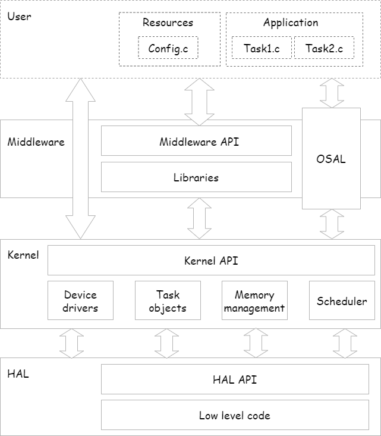
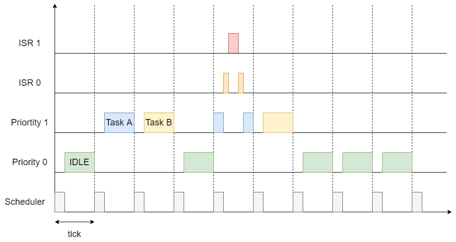
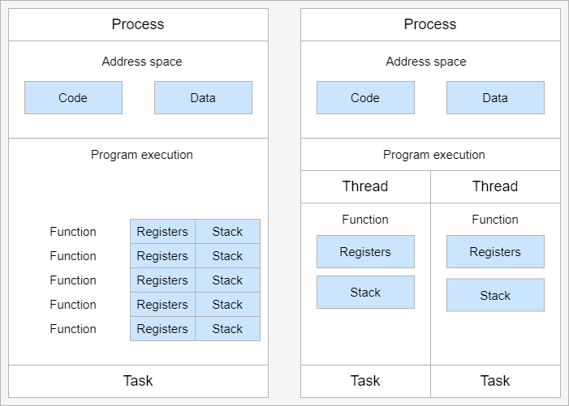

# Operating Systems

An operating system (OS) is a software that usually are used to scale applications easily and 
typically replaces the **superloop** found in simple systems. The operating system ...

- allows an easy scaling of the application (Chapters 2, 3, 4)
- manages how the CPU is allocated to different tasks (Chapters 5, 6, 7)
- manages how the memory is organized and how it is allocated (Chapter 8)
- manages how I/O devices communicate with the application (Chapter 9)
- manages the startup of the hardware (Chapter 10)

## 1. Classification


The are several differentiation criteria used to classify the operating system. If we take the 
access to the CPU in cosideration, then the operating systems is be classified as ...

- A **single-task OS** that allows a single task to use the CPU
- A **multi-tasking OS** that allows the execution of multiple tasks on a single CPU

Further operating systems might be further differentiated based on the number of users such 
as ...

- A **single-user OS** allows only a single user to use the OS
- A **multi-user OS** allows multiple users to use the OS

And finally based on their use case, the operating systems might be divided in the following 
categories ...

- **General-purpose OS** that ensures the execution of all tasks without blocking
- **Real-time OS** that ensures the execution of high priority tasks within a time limit
- **Distributed OS** that ensures the distribution of task on physically separated CPUs
- ...


### Practice

1. Determine the 3 basic categories of the following operating systems

- **MS-DOS**
- **Windows 95** 
- **Windows 10**
- **Unix**
- **FreeRTOS** 

2. In your oppinion what is the best operating system?
3. Is there a multi-user multi-task RTOS?


## 2. Structural analysis



### 2.1. Hardware

The computer usually has a mother board hosting a variaty of chips such as the CPU, memory, the 
peripherial controllers and the chipset which manages the data flow between all of these components.

### 2.2. HAL

General purpose operating systems such as Linux or Windows are written in such a way that they 
work without knowledge of the underlying hardware. This is achieved by using a special chip 
called BIOS (Basic Input/Output System). It separates the interface, which is used by the OS to 
work with hardware and the concrete implementation itself. In this case each motherboard produced is 
obliged to implement some basic functionality and provide the same interface to the operating 
system.

UEFI, BSP?

### 2.3. Operating system

The operating system usually consists of a kernel and some drivers used to access the file 
system and other critical functionality required to start the OS. The kernel itself can have 
different types of architectures, such as ...

- monolithic
- microkernel
- ...

### 2.4. Middleware

The operating system itself offers basic memory management and task synchronization services along
with higher level drivers such as the USB host system, the file system, network stacks and others.

Depending on the Windows version, different software libraries and drivers might be provided. 
For example Windows Pro or Windows Server provide much more features as Windows Home. These 
features are separated into a dedicated layer called middleware. 

The middleware provides a standard interface of OS related features to the application. The 
concrete implementation depends on the version of the underlying OS and is very similar in 
concept to the HAL layer.

### 2.5. OSAL

The middleware can be easily extended by the user providing own interfaces and libraries. One 
very useful component as part of the middleware is **OS abstraction layer** or the **OSAL**. As 
its counterpart on the hardware level, it allow separation of the interface of the basic kernel 
services from its implementation. This increases the reusability of the programming application 
allwoing the same software to run on different operating systems. In the **UNIX** world it is 
also named **POSIX**.

### 2.6. Application

The application layer is the end layer of the software stack. The application itself might also 
implement functionality of the middleware too, such as drivers or custom implementation of the 
OSAL interface. 

### Practice

A
- Identify the main hardware components on a development board
- Compare the embedded hardwate to a standard PC
- Clarify how embedded systems differ from standard hardware

B
- Create a new netXStudio template project with an operating system
- Identify the main components and find the HAL section

- Create a new netXStudio template project with an operating system
- Identify the main components of the operating system

C
- Create a new netXStudio template project with an operating system
- Identify the main components of the middleware

D
- Create a new netXStudio template project with an operating system
- Find the OSAL interface and its implementation

E
- Create a new netXStudio template project with an operating system
- Write a simple application which uses the UART to print 'Hello world!'


## 3. Dataflow analysis


The task usually can call the drivers and libraries from the middleware or the OS. Additionally to 
increase the usability of the program the task has also access to the OSAL interface. 

The middleware itself might use also OSAL for better reusability and has access to basic drivers 
provided by the operating system.

The drivers and the kernal of the OS always access the hardware using the hardware abstraction 
layer. 

### Practice
- Demo with a logger to show how the layers communicate with each other
- Learn how to trace the calls using debugging and profiling tools for a simple project


## 4. Runtime analysis



The idle task is responsible for freeing memory allocated by the RTOS to tasks that have since 
been deleted. It is therefore important in applications to ensure the idle task is not starved 
of processing time.

## 5. Task management

### 5.1. Task concept

A task is a simple program that runs as if it had the microprocessor all to itself.
Each owns a stack space to store temporary values and executes specific functions. Tasks 
might also have a priority based on their importance. 



 - Threads are tasks that share the same address space 
 - Processes are tasks with their own address space

### 5.2. Task states


The minimum set of states in typical task state model consists of the following states ...

1. **Running** (takes control of the CPU);
2. **Ready** (ready to be executed);
3. **Waiting** (blocked until an event occurrs, I/O for example).


### 5.3. Task scheduling

Schedulers determine which task to be executed at a given point of time and differ mainly in the 
way they distribute computation time between tasks in the READY state.

#### 5.3.1. Priority scheduling


With priority scheduling tasks are executed by their assigned prority. Usually higher numbers 
mean higher priority.

- Good for systems with variable time and resource requirements
- Precise control of the timing of critical tasks
- Starvation effect possible for intensive high priority tasks
- Starvation can be mitigated with the aging technique or by adding small delays

#### 5.3.2. Round-robin


With round-robin scheduling each task gets a certain amount of time or **time slices** to use
the CPU. After the predefined amount of time passes the scheduler deactivates the running
task and activates the next task that is in the READY state. This ensures that each task
gets some CPU time.

- No starvation effect as all tasks are executed
- Best reponse in terms of average reponse time accross all tasks
- Low slicing time reudces CPU efficiency due to frequent context switching
- Worser control of the timing of critical tasks

#### 5.3.3. First Come First Served


With this type of algorithm tasks are executed in order of their arrival. It is the easiest
and simplest CPU scheduling algorithm.

- Simple implementation
- Starvation effect possible if a tasks takes a long time to execute
- Higher average wait time compared to other scheduling algorithms

#### 5.3.5. Shortest Job First


With SJF tasks with shorter execution time have higher priority when scheduled for execution. 
This scheduling is mainly used to minimize the waiting time.

- Starvation efect possible
- Best average waiting time
- Needs an estimation of the burst time

### 5.4. Task switching

Task switching is the process of one task releasing and another task taking control of the CPU. 
The the state of the releasing task is saved, so that it can be restored and resume execution 
later. The task state is stored in a special structure called the **Task Control Block (TCB)**.

Switching algorithm:

1. Push the processor registers on the stack of the current task
2. Push the stack pointer on the stack of the current task
3. Push the local variables and return addresses on the stack
4. Load the stack pointer from the TCB of the new task
5. Load the processor registers from the values stored on the new task's stack

Some operating systems allow tasks to be interrupted by other more important tasks. This is 
called a **preemptive** context switching and is the dominant mechanism used in RTOS. The other 
type of switching is called **cooperative** and in this case the task must explicitly release 
the CPU before another task can take control. 

### Practice
- Write a scheduler with a priority switching
- Write a scheduler with round robin switching
- Write a scheduler with first-come-first-served scheduling


## 6. Task synchronization

Kernels provide a variety of services for synchronizing tasks, communicating between tasks and 
handling events.

### 6.1 Semaphore

Semaphore is an integer variable which is used as a **signaling mechanism** to allow a process to 
access the critical section of the code or certain other resources. A semaphore manages an internal counter 
which is decremented by each `acquire()` call and incremented by each `release()` call. The 
counter of the semaphore can never go below zero and when `acquire()` finds that it is zero, it 
blocks, waiting until some other task calls `release()`.

Upon releasing the semaphore the kernel determines the highest priority task waiting for the 
semaphore and passes it to the task. If the task releasing the semaphore is of higher priority 
than the task waiting for the semaphore, then the releasing task continues executing. Otherwise the 
releasing task is preempted and the kernel switches to the waiting task.

Depending on the counter type there are two types of semaphores:

1. **Binary** - used to access a single resource. It holds the value of 0 or 1,
signaling that the resource is occupied or available

2. **Counting** - A counting semaphore stores the number of free instances of said resource and
blocks until an instance becomes available.

 

### 6.2 Mutex

A mutex or the mutual exclusion service is a special type of **locking mechanism** which 
resembles the binary semaphore. It implements additionally an algorithm called **priority 
inheritance** to solve a common problem of semaphores called **priority inversion**.

#### 6.2.1 Priority inversion

A typical exapmple of priority inversion is when several tasks with different priority levels 
use semaphores and try to access the CPU ...


1. A Low Priority Task (LP Task) owns a semaphore for accessing a given resource
2. A High Prioriy Task (HP Task) waits for a resource currently owned by the LP Task
3. A Medium Priority Task (MP Task) becomes ready-to-run (after an event occurres or a delay passes)
and preempts the LP Task.
4. The MP Task completes execution.
5. The LP Task resumes
6. The LP Task finishes using the resouce and releases the semaphore
7. The HP Task acquires the semaphore and resumes

In this situation the priority of the HP Task is essentially reduced to that of the LP Task
that it waits for to finish using a resource. Because of that the HP Task gets unnecessarily 
delayed.

#### 6.2.2. Priority inheritance

A mutex would elevate the priority of the LP task to that of the HP task. In this way the medium 
priority task will not be scheduled for execution while the mutex is acquired. This mechanism is 
also called priority inheritance.


1. A Low Priority Task (LP Task) owns a mutex for accessing a given resource
2. A High Prioriy Task (HP Task) waits for a resource currently owned by the LP Task
3. The priority of the LP task is elevated to that of the HP task
4. A Medium Priority Task (MP Task) becomes ready
5. The LP Task is temporary with higher priority and resumes
6. The LP Task finishes using the resource and releases the mutex
7. The HP Task acquires the mutex and resumes
8. The HP Task finishes using the resource and releases the mutex
9. The MP Task is scheduled for execution

### 6.3. Lock

A reader-writer lock allows simultaneous access for read-only operations while write operations 
require exclusive access.

Multiple tasks can read at the same time, but a writing task will block others from reading or 
writing. A readers-writer block can also be implemented using semaphores and mutexes.


### 6.4. Event
Events are similar to interrupts in the sense that they are a signaling 


### 6.5. Common synchronziation problems

- Deadlock
- Starvation
- Priority inversion


## 7. Task communication

### 7.1 Mailbox

- A mailbox is a **message buffer** managed by the RTOS.
- The messages have **fixed data size** and are usually small.
- Mailboxes work as **FIFO** (first in, first out)
- Tasks can **send and retrieve** messages to/from the mailbox
- If the **mailbox is empty the reading task be blocked** for a specified amount of time or 
  until a message arrives.
- When a message arrives the **kernel notifies the waiting task** and the scheduler determines 
  if a task switching must be done, according to the priority of the running task and the task 
  waiting for a message

### 7.2 Queues

- Queues are **message buffers**
- Queues accept **messages of different lengths**.
- The **message size must be passed as a parameter** along with the message.
- Tasks can **send and retrieve** messages to/from the queue
- If the **queue is empty the reading task be blocked** for a specified amount of time or 
  until a message arrives.
- When a message arrives the **kernel notifies the waiting task** and the scheduler determines 
  if a task switching must be done, according to the priority of the running task and the task 
  waiting for a message


## 8. Memory management

```commandline
TODO: Image of the points below
```
- static for global and static variables
- stack for local variables
- heap for dynamic allocation
- Explain some important concepts such as memory initialization and NULL

```commandline
TODO: Image of the points below
```
- Explain the function of the linker
- Take a look at a program (for example .com, .exe or .elf)
- Explain how the program is loaded in to the memory

## 9. Registers
...

## 10. Interrupts

Interrupts are special signals which cause the CPU to halt the current execution and jump to an 
address which contains an **Interrupt Service Routine (ISR)**. The interrupts are an efficient 
mechanism used by I/O devices to signal that there is data available and relieve the processor from 
constant polling of the I/O device status. 

The interrupts can be configured by using the so called **Interrupt Descriptor Table (IDT)** which 
maps interrupt requests to the address of the memory of the ISR. Note that definitions of ISR and 
**interrupt handler** are identical. 

Some interrupts can be also disabled using masks. Such interrupts are also called **maskable 
interrupts**.

```commandline
TODO: Picture of the process and the IDT
```

### 10.1. Hardware interrupts

Hardware interrupts are interruptions of a program caused by hardware. When an interrupt occurres
the CPU saves its registers and executes an ISR (Interrupt service routine). After the 
ISR is completed the highest priority task which is ready to run executes.

### 10.2. Software interrupts

Software interrupts are caused by an exceptional condition or a special instruction
which causes an interrupt when executed.

### 10.3. Nesting and priorities

In multi-tasking environments the **ISR can interrupt even high priorities tasks** and the 
scheduler. The interrupts themselves can be also **nested and have priorities** and usually lower 
numbers means higher priority. An interrupt ca never be interrupted by an interrupt of lower or 
equal priority. If two different interrupts occur at the same time the one with the higher 
priority gets executed first.

### 10.4. Interrupt latency

Interrupt latency is the time between the interrupt occurres and the time when the
according ISR starts executing. The worst case interrupt latency is an important value
regarding a RTOS.


## 11. Boot process

After reset the CPU always jumps to a predefined address and starts the execution from there. 
The program found there is called the startup code. It initializes the memory and for simple 
operating systems the next step is to call the main function. The main function will the further
initialize the operating system, the hardware, create application tasks and then transfer 
control to the scheduler.

```commandline
TODO: Boot process visualization
```

## References

- https://www.youtube.com/playlist?list=PLEBQazB0HUyQ4hAPU1cJED6t3DU0h34bz
- https://www.tutorialspoint.com/operating_system/os_process_scheduling_algorithms.htm
- https://data-flair.training/blogs/scheduling-algorithms-in-operating-system/
- https://digital.com/program-your-own-os/
- https://littleosbook.github.io/
- https://www.geeksforgeeks.org/mutex-vs-semaphore/
- https://www.beningo.com/5-best-practices-for-designing-rtos-based-applications/
- https://kb.hilscher.com/display/GPS/Job-Worker+Task+Model
- https://en.wikipedia.org/wiki/Booting


## Good practices
 - Optimization of functions (3 parameters, 4 bytes)
 - Semaphore is a check, Mutex blocks
 - The main() function will not be interrupted by any of the created tasks because those
tasks execute only following the call to OS_Start(). It is therefore usually recommended to
create all or most of your tasks here, as well as your control structures such as mailboxes
and semaphores. Good practice is to write software in the form of modules which are (up
to a point) reusable. These modules usually have an initialization routine, which creates
any required task(s) and control structures. A typical main() function looks similar to the
following example:

```commandline
void main(void) {

  // Initialize embOS (must be first)
  OS_Init();    
  
  // Initialize hardware for embOS (in RTOSInit.c)
  OS_InitHW();  
  
  // Call Init routines of all program modules which in turn will create
  // the tasks they need ... (Order of creation may be important)
  MODULE1_Init();
  MODULE2_Init();
  MODULE3_Init();
  MODULE4_Init();
  MODULE5_Init();
  
  // Start multitasking
  OS_Start(); 
}
```